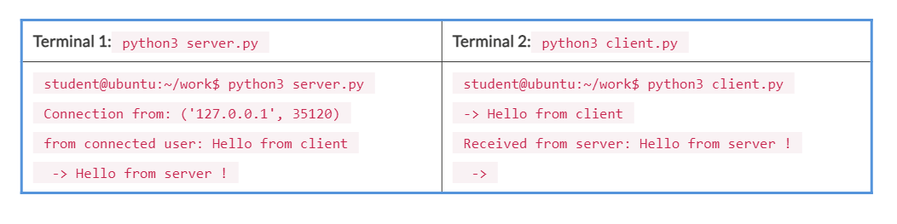

Lab 10. Basic Networking - Socket Programming
----------------------------------------------------------


In this lab, you will learn about sockets and three internet
protocols: `http`, `ftplib`, and `urllib`.
You will also learn about the `socket` module in Python, which
is used for networking. `http` is a package that is used for
working with the **Hypertext Transfer Protocol**
(**HTTP**). The `ftplib` module is used for
performing automated FTP-related work.
`urllib` is a package that handles URL-related work.

In this lab, you will learn about the following:


-   Sockets
-   The `http` package
-   The `ftplib` module
-   The `urllib` package


Sockets
-------------------------


In this section, we are going to learn about
sockets. We are going to use Python\'s socket module. Sockets are
endpoints for communication between machines, whether locally or across
the internet. The socket module has a socket class, which is used to
handle the data channel. It also has functions for network-related
tasks. To use the functionality of the socket module, we first need to
import the socket module.

Let\'s see how to create a socket. The socket class has a socket
function, with two arguments: `address_family` and
`socket type`.

 

 

The following is the syntax:


```
            import socket
 s = socket.socket(address_family, socket type)
```

`address_family` controls the OSI network layer protocol.

**`socket type`** controls the transport layer
protocol.

Python supports three address families: `AF_INET`,
`AF_INET6`, and `AF_UNIX`. The most commonly used is
`AF_INET`, which is used for internet addressing.
`AF_INET6` is used for IPv6 internet addressing.
`AF_UNIX` is used for **Unix Domain Sockets**
(**UDS**), which is an inter-process communication protocol.

There are two socket types: `SOCK_DGRAM` and
`SOCK_STREAM`. The `SOCK_DGRAM` socket type is used
for message-oriented datagram transport; these are associated with the
UDP. Datagram sockets deliver individual
messages. `SOCK_STREAM` is used for stream-oriented transport;
these are associated with TCP. Stream sockets provide byte streams
between the client and server.

Sockets can be configured as server and client sockets. When both TCP/IP
sockets are connected, communication will be bi-directional. Now we are
going explore an example of client-server communication. We will create
two scripts: `server.py` and `client.py`.

The `server.py` script is as follows:


```
import socket

host_name = socket.gethostname()
port = 5000
s_socket = socket.socket()
s_socket.bind((host_name, port))
s_socket.listen(2)

conn, address = s_socket.accept()
print("Connection from: " + str(address))

while True:
            recv_data = conn.recv(1024).decode()
            if not recv_data:
                        break
            print("from connected user: " + str(recv_data))
            recv_data = input(' -> ')
conn.send(recv_data.encode())

conn.close()
```

 

 

 

 

Now we will write a script for the client.

The `client.py` script is as follows:


```
import socket

host_name = socket.gethostname()
port = 5000

c_socket = socket.socket()
c_socket.connect((host_name, port))
msg = input(" -> ")

while msg.lower().strip() != 'bye':
            c_socket.send(msg.encode())
            recv_data = c_socket.recv(1024).decode()
            print('Received from server: ' + recv_data)
            msg = input(" -> ")

c_socket.close()
```

Now we will run these two programs in two
different Terminals. In the first Terminal, we\'ll run
`server.py`, and in the second terminal, run
`client.py`.

The output will be as follows:




The http package
----------------------------------


In this section, we are going to learn about
the `http` package. The `http` package has four
modules:


-   `http.client`: This is a low-level HTTP protocol client
-   `http.server`: This contains basic HTTP server classes
-   `http.cookies`: This is used for implementing state
    management with cookies
-   `http.cookiejar`: This module provides cookie persistence
:::

 

 

In this section, we are going to learn about the `http.client`
and `http.server` modules.


### The http.client module


We are going to see two `http` requests: `GET` and
`POST`. We are also going to make
an `http` connection.

First, we are going explore an example of making an `http`
connection. For that, create a `make_connection.py` script and
write the following content in it:


```
import http.client

con_obj = http.client.HTTPConnection('Enter_URL_name', 80, timeout=20)
print(con_obj)
```

Run the script and you will get the output as follows:


```
student@ubuntu:~/work$ python3 make_connection.py
<http.client.HTTPConnection object at 0x7f2c365dd898>
```

In the preceding example, we made a connection with the URL mentioned on
port 80 for a specific timeout.

Now we will see the `http``GET` request
method; using this `GET` request method, we will see an
example where we get a response code as well as a header list. Create a
`get_example.py` script and write the following content in it:


```
import http.client

con_obj = http.client.HTTPSConnection("www.imdb.com")
con_obj.request("GET", "/")
response = con_obj.getresponse()

print("Status: {}".format(response.status))

headers_list = response.getheaders()
print("Headers: {}".format(headers_list))

con_obj.close()
```

Run the script as follows:


```
student@ubuntu:~/work$ python3 get_example.py
```

 

 

 

 

The output should be as follows:


```
Status: 200
Headers: [('Server', 'Server'), ('Date', 'Fri, 23 Nov 2018 09:49:12 GMT'), ('Content-Type', 'text/html;charset=UTF-8'), ('Transfer-Encoding', 'chunked'), ('Connection', 'keep-alive'), ('X-Frame-Options', 'SAMEORIGIN'), ('Content-Security-Policy', "frame-ancestors 'self' imdb.com *.imdb.com *.media-imdb.com withoutabox.com *.withoutabox.com amazon.com *.amazon.com amazon.co.uk *.amazon.co.uk amazon.de *.amazon.de translate.google.com images.google.com www.google.com www.google.co.uk search.aol.com bing.com www.bing.com"), ('Ad-Unit', 'imdb.home.homepage'), ('Entity-Id', ''), ('Section-Id', 'homepage'), ('Page-Id', 'homepage'), ('Content-Language', 'en-US'), ('Set-Cookie', 'uu=BCYsgIz6VTPefAjQB9YlJiZhwogwHmoU3sLx9YK-A61kPgvXEKwHSJKU3XeaxIoL8DBQGhYLuFvR%0D%0AqPV6VVvx70AV6eL_sGzVaRQQAKf-PUz2y0sTx9H4Yvib9iSYRPOzR5qHQkwuoHPKmpu2KsSbPaCb%0D%0AYbc-R6nz9ObkbQf6RAYm5sTAdf5lSqM2ZzCEhfIt_H3tWQqnK5WlihYwfMZS2AJdtGXGRnRvEHlv%0D%0AyA4Dcn9NyeX44-hAnS64zkDfDeGXoCUic_kH6ZnD5vv21HOiVodVKA%0D%0A; Domain=.imdb.com; Expires=Wed, 11-Dec-2086 13:03:18 GMT; Path=/; Secure'), ('Set-Cookie', 'session-id=134-6809939-6044806; Domain=.imdb.com; Expires=Wed, 11-Dec-2086 13:03:18 GMT; Path=/; Secure'), ('Set-Cookie', 'session-id-time=2173686551; Domain=.imdb.com; Expires=Wed, 11-Dec-2086 13:03:18 GMT; Path=/; Secure'), ('Vary', 'Accept-Encoding,X-Amzn-CDN-Cache,User-Agent'), ('x-amz-rid', '7SWEYTYH4TX8YR2CF5JT')]
```

In the preceding example, we used `HTTPSConnection`, as the
website is served over the `HTTPS` protocol. You can use
`HTTPSConnection` or `HTTPConnection`, depending on
the website you use. We provided a URL and checked the status with the
connection object. After that, we got a header list. This header list
contains information regarding the type of data sent back from the
server. The `getheaders()` method will get list of headers.

Now we will see an example of a `POST` request. We can post
data to the URL using `HTTP POST`. For that, create a
`post_example.py` script and write following content in it:


```
import http.client
import json

con_obj = http.client.HTTPSConnection('www.httpbin.org')
headers_list = {'Content-type': 'application/json'}
post_text = {'text': 'Hello World !!'}
json_data = json.dumps(post_text)
con_obj.request('POST', '/post', json_data, headers_list)
response = con_obj.getresponse()
print(response.read().decode())
```

 

 

 

 

 

 

 

 

 

 

 

 

 

 

 

 

 

 

 

 

Run the script as follows:


```
student@ubuntu:~/work$ python3 post_example.py
```

You should get the following output:


```
{
 "args": {},
 "data": "{\"text\": \"Hello World !!\"}",
 "files": {},
 "form": {},
 "headers": {
    "Accept-Encoding": "identity",
    "Connection": "close",
    "Content-Length": "26",
    "Content-Type": "application/json",
    "Host": "www.httpbin.org"
  },
  "json": {
    "text": "Hello World !!"
  },
  "origin": "1.186.106.115",
  "url": "https://www.httpbin.org/post"
}
```

In the preceding example, we first created
an `HTTPSConnection` object. Next, we created a
`post_text` object, which posts `Hello World`. After
that, we wrote a `POST` request, to which we
received a response.


### The http.server module


In this section, we are going to learn about a module from
the `http` package, the `http.server` module. This
module defines the classes used for implementing
`HTTP` servers. It has two methods: `GET` and
`HEAD`. By using this module, we can share files over a
network. You can run the `http` server on any port. Make
sure the port number is greater than
`1024`. The default port number is `8000`.

You can use `http.server` as follows.

First, navigate to your desired directory and run the following command:


```
student@ubuntu:~/Desktop$ python3 -m http.server 9000
```

 

 

 

 

 

 

 

 

 

 

Now open your browser and write `localhost:9000` in your
address bar and press [*Enter*]{.emphasis}. You will get the output
following:


```
student@ubuntu:~/Desktop$ python3 -m http.server 9000
Serving HTTP on 0.0.0.0 port 9000 (http://0.0.0.0:9000/) ...
127.0.0.1 - - [23/Nov/2018 16:08:14] code 404, message File not found
127.0.0.1 - - [23/Nov/2018 16:08:14] "GET /Downloads/ HTTP/1.1" 404 -
127.0.0.1 - - [23/Nov/2018 16:08:14] code 404, message File not found
127.0.0.1 - - [23/Nov/2018 16:08:14] "GET /favicon.ico HTTP/1.1" 404 -
127.0.0.1 - - [23/Nov/2018 16:08:21] "GET / HTTP/1.1" 200 -
127.0.0.1 - - [23/Nov/2018 16:08:21] code 404, message File not found
127.0.0.1 - - [23/Nov/2018 16:08:21] "GET /favicon.ico HTTP/1.1" 404 -
127.0.0.1 - - [23/Nov/2018 16:08:26] "GET /hello/ HTTP/1.1" 200 -
127.0.0.1 - - [23/Nov/2018 16:08:26] code 404, message File not found
127.0.0.1 - - [23/Nov/2018 16:08:26] "GET /favicon.ico HTTP/1.1" 404 -
127.0.0.1 - - [23/Nov/2018 16:08:27] code 404, message File not found
127.0.0.1 - - [23/Nov/2018 16:08:27] "GET /favicon.ico HTTP/1.1" 404 -
```


The ftplib module
------------------------------------


`ftplib` is a module in Python that provides[]{#id326648258
.indexterm} all the functionality needed to perform various actions over
the FTP protocol. `ftplib` contains the FTP client class, as
well as some helper functions. Using this module, we can easily connect
to an FTP server to retrieve multiple files and process them. By
importing the `ftplib` module, we can use all the
functionality it provides.

In this section, we are going to cover how to do FTP transfers by using
the `ftplib` module. We are going see various FTP objects.


### Downloading files


In this section, we are going to learn about downloading[]{#id326648226
.indexterm} files from another machine using `ftplib`. For
that, create a `get_ftp_files.py` script and write the
following content in it:


```
import os
from ftplib import FTP

ftp = FTP('your-ftp-domain-or-ip')
with ftp:
    ftp.login('your-username','your-password')
    ftp.cwd('/home/student/work/')
    files = ftp.nlst()
    print(files)
    # Print the files
    for file in files:
        if os.path.isfile(file):
            print("Downloading..." + file)
            ftp.retrbinary("RETR " + file ,open("/home/student/testing/" + file, 'wb').write)

ftp.close()
```

Run the script as follows:


```
student@ubuntu:~/work$ python3 get_ftp_files.py
```

You should get the following output:


```
Downloading...hello
Downloading...hello.c
Downloading...sample.txt
Downloading...strip_hello
Downloading...test.py
```

In the preceding example, we retrieved multiple files from the host by
using the `ftplib` module. First, we mentioned the IP address,
username, and password of the other machine. To get all the files from
the host, we used the `ftp.nlst()` function, and to download
those files to our computer, we used the `ftp.retrbinary()`
function.


### Getting a welcome message using getwelcome():


Once an initial connection is established, a server
usually returns a welcome message. This
message comes via the `getwelcome()` function, and sometimes
includes disclaimers or helpful information
that may be relevant to the user.

Now we will see an example of `getwelcome()`. Create a
`get_welcome_msg.py` script and write the following content in
it:


```
from ftplib import FTP

ftp = FTP('your-ftp-domain-or-ip')
ftp.login('your-username','your-password')

welcome_msg = ftp.getwelcome()
print(welcome_msg)

ftp.close()
```

Run the script as follows:


```
student@ubuntu:~/work$ python3 get_welcome_msg.py
220 (vsFTPd 3.0.3)
```

In the preceding code, we first mentioned the IP address, username, and
password of the other machine. We used the `getwelcome()`
function to get information after the initial connection was
established.


### Sending commands to the server using the sendcmd() function


In this section, we are going to learn about the `sendcmd()`
function. We can use the `sendcmd()` function to send a simple
`string` command to the server to get the
String response. The client can send FTP
commands such as `STAT`, `PWD`, `RETR`,
and `STOR`. The `ftplib` module has multiple methods
that can wrap these commands. The commands
can be sent using the `sendcmd()` or `voidcmd()`
methods. As an example, we are going to send a `STAT` command
to check the status of a server.

Create a `send_command.py` script and write the following
content in it:


```
from ftplib import FTP

ftp = FTP('your-ftp-domain-or-ip')
ftp.login('your-username','your-password')

ftp.cwd('/home/student/')
s_cmd_stat = ftp.sendcmd('STAT')
print(s_cmd_stat)
print()

s_cmd_pwd = ftp.sendcmd('PWD')
print(s_cmd_pwd)
print()

ftp.close()
```

Run the script as follows:


```
student@ubuntu:~/work$ python3 send_command.py
```

 

 

You will get the following output:


```
211-FTP server status:
     Connected to ::ffff:192.168.2.109
     Logged in as student
   TYPE: ASCII
     No session bandwidth limit
     Session timeout in seconds is 300
     Control connection is plain text
     Data connections will be plain text
     At session startup, client count was 1
     vsFTPd 3.0.3 - secure, fast, stable
211 End of status

257 "/home/student" is the current directory
```

In the preceding code, we first mentioned the IP address, username, and
password of the other machine. Next, we used the `sendcmd()`
method for the `STAT` command to the other machine. Then, we
used `sendcmd()` for the `PWD` command.


The urllib package
-------------------------------------


Like `http`, `urllib` is also a package that has
various modules for working with URLs. The
`urllib` module allows you to access several websites via your
script. We can also download data, parse data, modify headers, and more
using this module.

`urllib` has a few different modules, which are listed here:


-   `urllib.request`: This is used for opening and reading
    URLs.
-   `urllib.error`: This contains exceptions raised by
    `urllib.request`.
-   `urllib.parse`: This is used for parsing URLs.
-   `urllib.robotparser`: This is used for parsing
    `robots.txt` files.
:::

In this section, we are going to learn about opening a URL using
`urllib` and how to read `html` files from the URL.
We are going to see a simple example of the use
of `urllib`. We will import `urllib.requests`. Then
we assign the opening of the URL to a variable, then we will use a
`.read()` command to read the data from the URL. 

 

 

Create a`url_requests_example.py` script and write the
following content in it:


```
import urllib.request

x = urllib.request.urlopen('https://www.imdb.com/')
print(x.read())
```

Run the script as follows:


```
student@ubuntu:~/work$ python3 url_requests_example.py
```

Here is the output:


```
b'\n\n<!DOCTYPE html>\n<html\n    xmlns:og="http://ogp.me/ns#"\n    xmlns:fb="http://www.facebook.com/2008/fbml">\n    <head>\n         \n        <meta charset="utf-8">\n        <meta http-equiv="X-UA-Compatible" content="IE=edge">\n\n    \n    \n    \n\n    \n    \n    \n\n    <meta name="apple-itunes-app" content="app-id=342792525, app-argument=imdb:///?src=mdot">\n\n\n\n        <script type="text/javascript">var IMDbTimer={starttime: new Date().getTime(),pt:\'java\'};</script>\n\n<script>\n    if (typeof uet == \'function\') {\n      uet("bb", "LoadTitle", {wb: 1});\n    }\n</script>\n  <script>(function(t){ (t.events = t.events || {})["csm_head_pre_title"] = new Date().getTime(); })(IMDbTimer);</script>\n        <title>IMDb - Movies, TV and Celebrities - IMDb</title>\n  <script>(function(t){ (t.events = t.events || {})["csm_head_post_title"] = new Date().getTime(); })(IMDbTimer);</script>\n<script>\n    if (typeof uet == \'function\') {\n      uet("be", "LoadTitle", {wb: 1});\n    }\n</script>\n<script>\n    if (typeof uex == \'function\') {\n      uex("ld", "LoadTitle", {wb: 1});\n    }\n</script>\n\n        <link rel="canonical" href="https://www.imdb.com/" />\n        <meta property="og:url" content="http://www.imdb.com/" />\n        <link rel="alternate" media="only screen and (max-width: 640px)" href="https://m.imdb.com/">\n\n<script>\n    if (typeof uet == \'function\') {\n      uet("bb", "LoadIcons", {wb: 1});\n    }\n</script>\n  <script>(function(t){ (t.events = t.events || {})["csm_head_pre_icon"] = new Date().getTime(); })(IMDbTimer);</script>\n        <link href="https://m.media-amazon.com/images/G/01/imdb/images/safari-favicon-517611381._CB483525257_.svg" mask rel="icon" sizes="any">\n        <link rel="icon" type="image/ico" href="https://m.media-amazon.com/images/G/01/imdb/images/favicon-2165806970._CB470047330_.ico" />\n        <meta name="theme-color" content="#000000" />\n        <link rel="shortcut icon" type="image/x-icon" href="https://m.media-amazon.com/images/G/01/imdb/images/desktop-favicon-2165806970._CB484110913_.ico" />\n        <link href="https://m.media-amazon.com/images/G/01/imdb/images/mobile/apple-touch-icon-web-4151659188._CB483525313_.png" rel="apple-touch-icon"> \n
```

 

 

In the preceding example, we used the `read()` method, which
returns the byte array. This prints the HTML data returned by the
`Imdb` home page in a non-human-readable format, but we can
use the HTML parser to extract some useful information from it.


### Python urllib response headers


We can get response headers by calling the `info()` function
on the response object. This returns a
dictionary, so we can also extract specific header data from the
response. Create a `url_response_header.py` script and write
the following content in it:


```
import urllib.request

x = urllib.request.urlopen('https://www.imdb.com/')
print(x.info())
```

Run the script as follows:


```
student@ubuntu:~/work$ python3 url_response_header.py
```

Here is the output:


```
Server: Server
Date: Fri, 23 Nov 2018 11:22:48 GMT
Content-Type: text/html;charset=UTF-8
Transfer-Encoding: chunked
Connection: close
X-Frame-Options: SAMEORIGIN
Content-Security-Policy: frame-ancestors 'self' imdb.com *.imdb.com *.media-imdb.com withoutabox.com *.withoutabox.com amazon.com *.amazon.com amazon.co.uk *.amazon.co.uk amazon.de *.amazon.de translate.google.com images.google.com www.google.com www.google.co.uk search.aol.com bing.com www.bing.com
Content-Language: en-US
Set-Cookie: uu=BCYsJu-IKhmmXuZWHgogzgofKfB8CXXLkNXdfKrrvsCP-RkcSn29epJviE8uRML4Xl4E7Iw9V09w%0D%0Anl3qKv1bEVJ-hHWVeDFH6BF8j_MMf8pdVA2NWzguWQ2XbKvDXFa_rK1ymzWc-Q35RCk_Z6jTj-Mk%0D%0AlEMrKkFyxbDYxLMe4hSjUo7NGrmV61LY3Aohaq7zE-ZE8a6DhgdlcLfXsILNXTkv7L3hvbxmr4An%0D%0Af73atPNPOgyLTB2S615MnlZ3QpOeNH6E2fElDYXZnsIFEAb9FW2XfQ%0D%0A; Domain=.imdb.com; Expires=Wed, 11-Dec-2086 14:36:55 GMT; Path=/; Secure
Set-Cookie: session-id=000-0000000-0000000; Domain=.imdb.com; Expires=Wed, 11-Dec-2086 14:36:55 GMT; Path=/; Secure
Set-Cookie: session-id-time=2173692168; Domain=.imdb.com; Expires=Wed, 11-Dec-2086 14:36:55 GMT; Path=/; Secure
Vary: Accept-Encoding,X-Amzn-CDN-Cache,User-Agent
x-amz-rid: GJDGQQTNA4MH7S3KJJKV
```


Summary
--------------------------


In this lab, we learned about sockets, which are used for
bi-directional client-server communication. We learned about three
internet modules: `http`, `ftplib`, and
`urllib`. The `http` package has modules for the
client and server: `http.client` and `http.server`
respectively. Using `ftplib`, we downloaded files from another
machine. We also looked at welcome messages and sending `send`
commands.

In the next lab, we\'ll be covering building and sending emails. We
will learn about message formats and adding multimedia content. Also, we
are going to learn about SMTP, POP, and IMAP servers.


Questions
----------------------------


1.  What is socket programming?
2.  What is RPC?
3.  What are the different ways to import to user-defined modules or
    files?
4.  What is the difference between a list and a tuple ?
5.  Can we have duplicate keys in a dictionary?
6.  What are the differences between the `urllib`,
    `urllib2`, and `requests` modules?


Further reading
----------------------------------


-   `ftplib`
    documentation: <https://docs.python.org/3/library/ftplib.html> 
-   `xmlrpc`
    documentation: <https://docs.python.org/3/library/xmlrpc.html> 
