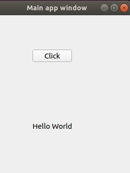
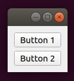
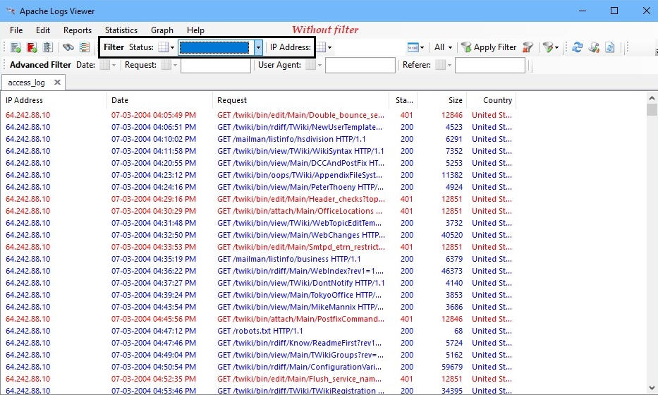
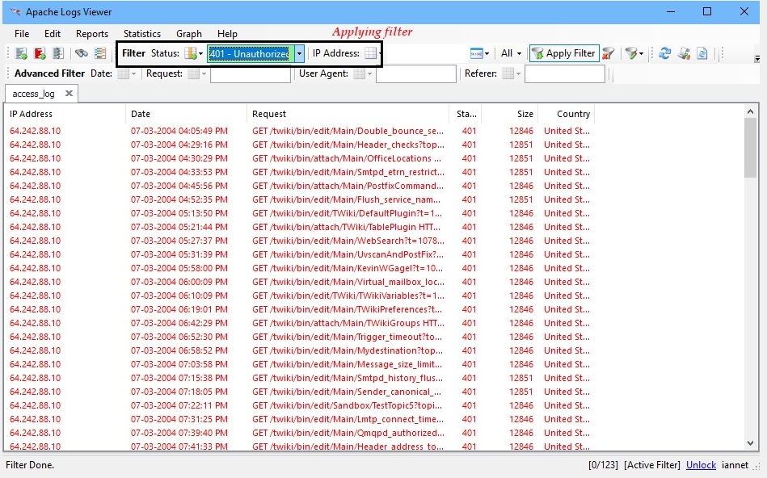

Lab 13. Building Graphical User Interfaces
-------------------------------------------------------


In this lab, you will study **Graphical User Interface**
(**GUI**) development. There are various Python
libraries that you can use to  make GUI. We are going to learn about the
PyQt5 Python library for GUI creation.

In this lab, you will learn the following topics:


-   Introduction to GUI
-   Using a library to create a GUI-based application
-   Installing and using the Apache Log Viewer app


Introduction to GUI
--------------------------------------


In this section, we are going to learn about GUI. Python has various
frameworks for GUI. In this section, we are
going to look at PyQt5. PyQt5 has different graphics components, also
known as object widgets, which can be
displayed on screen and also interact with
users. The components are listed here:


-   **PyQt5 window**: The PyQt5 window will create a simple
    app window.
-   **PyQt5 button**: The PyQt5 button is a button that
    causes an action whenever it is clicked.
-   **PyQt5 textbox**: The PyQt5 textbox widget allows users
    to enter the text.
-   **PyQt5 label**: The PyQt5 label widget displays a
    single-line text or an image.
-   **PyQt5 combo box**: The PyQt5 combo box widget is a
    combined button and a popup list.
-   **PyQt5 check box**: The PyQt5 check box widget is an
    option button that can be checked and unchecked.
-   **PyQt5 radio button**: The PyQt5 radio button widget is
    an option button that can be checked or unchecked. In a group of
    radio buttons, only one of the buttons can be checked at a time.
-   **PyQt5 message box**: The PyQt5 message box widget
    display a message.
-   **PyQt5 menu**: The PyQt5 menu widget gives different
    choices that are displayed.
-   **PyQt5 table**: The PyQt5 table widget provides standard
    table display functionality for applications, which can be
    constructed with a number of rows and columns.
-   **PyQt5 signals/slots**: Signals will let you react to
    the event that has occurred and slot is simply a function that gets
    called whenever a signal occurs.
-   **PyQt5 layouts**: The PyQt5 layouts consist of multiple
    widgets.


There are several PyQt5 classes available,
which are divided into different modules. These modules are listed here:


-   `QtGui`: `QtGui` contains classes for event
    handling, graphics, fonts, texts, and basic imaging.
-   `QtWidgets`: `QtWidgets`contains classes to
    create desktop-style user interfaces.
-   `QtCore`: `QtCore` contains core non-GUI
    functionality such as time, directories, files, streams, URLs, data
    types, threads, and processes.
-   `QtBluetooth`: `QtBluetooth`contains classes for
    connecting with devices and interacting with them.
-   `QtPositioning`: `QtPositioning`contains classes
    to determine the position.
-   `QtMultimedia`: `QtMultimedia`contains classes
    for APIs and multimedia content.
-   `QtNetwork`: `QtNetwork` contains classes for
    network programming.
-   `QtWebKit`: `QtWebkit` contains classes for web
    browser implementation.
-   `QtXml`: `QtXml` contains classes for XML files.
-   `QtSql`: `QtSql` contains classes for databases.


The GUI is driven by the events. Now, what is an event? An event is a
signal that indicates that something has happened in your program, for
example, menu selection, mouse movement, or button clicks. The events
are handled by functions and triggered when a user performs some actions
on the objects. The listener will listen to the event and then it will
invoke an event handler whenever an event occurs.


Using a library to create a GUI-based application
--------------------------------------------------------------------


Now, we are actually going to use the PyQt5
library to create a simple GUI application. In this section, we are
going to create a simple window. In that window, we will have one button
and a label. After clicking on that button,
some message will get printed in the label.

First, we will see how to create the button widget. The following line
will create a button widget:


```
b = QPushButton('Click', self)
```

Now, we will see how to create a label. The following line will create a
label:


```
            l = QLabel(self)
```

Now, we will see how to create the button and label and how to perform
an operation after clicking on that button. For that, create
a `print_message.py`script and write following code in it:


```
import sys
from PyQt5.QtWidgets import QApplication, QLabel, QPushButton, QWidget
from PyQt5.QtCore import pyqtSlot
from PyQt5.QtGui import QIcon

class simple_app(QWidget):
            def __init__(self):
                        super().__init__()
                        self.title = 'Main app window'
                        self.left = 20
                        self.top = 20
                        self.height = 300
                        self.width = 400
                        self.app_initialize()

            def app_initialize(self):
                        self.setWindowTitle(self.title)
                        self.setGeometry(self.left, self.top, self.height, self.width)
                        b = QPushButton('Click', self)
                        b.setToolTip('Click on the button !!')
                        b.move(100,70)
                        self.l = QLabel(self)
                        self.l.resize(100,50)
                        self.l.move(100,200)
                        b.clicked.connect(self.on_click)
                        self.show()

            @pyqtSlot()
            def on_click(self):                   
                        self.l.setText("Hello World")

if __name__ == '__main__':
            appl = QApplication(sys.argv)
            ex = simple_app()
            sys.exit(appl.exec_())
```

Run the script and you will get the output as follows:


```
student@ubuntu:~/gui_example$ python3 print_message.py
```

 





In the preceding example, we imported the necessary PyQt5 modules. Then,
we created the application. The `QPushButton` creates the
widget and the first argument we entered is a text that will be printed
on the button. Next, we have a `QLabel` widget on which we are
printing a message, which will get printed when we will click on the
button. Next, we created an `on_click()`function that will
perform the printing operation after clicking on the button. The
`on_click()` is the slot we created.

 

Now, we are going to see an example of the box layout. For that, create
a `box_layout.py`script and write following code in it:


```
from PyQt5.QtWidgets import QApplication, QWidget, QPushButton, QVBoxLayout

appl = QApplication([])
make_window = QWidget()
layout = QVBoxLayout()

layout.addWidget(QPushButton('Button 1'))
layout.addWidget(QPushButton('Button 2'))

make_window.setLayout(l)
make_window.show()

appl.exec_()
```

Run the script and you will get the following
output:


```
student@ubuntu:~/gui_example$ python3 box_layout.py
```





In the preceding example, we created a box layout. In that we have
placed two buttons. This script is just for explaining the box layout.
`l = QVBoxLayout()` will create a box layout.


Installing and using the Apache Log Viewer app
-----------------------------------------------------------------


As we already have an Apache Log Viewer app, download the
Apache Log Viewer app from the following
link: <https://www.apacheviewer.com/download/>.

 

After downloading it, install the app on your
computer. This app is useful for analyzing log files based on their
connection status, IP addresses, and much more. Therefore, to analyze
the log file we can simply browse access log file or error log file.
After getting the file, we apply different operations on a log file such
as applying a filter, for instance to sort the only files from
`access.log` that have unsuccessful connections, or filtering
by specific IP addresses.

The following screenshot shows Apache log viewer with
the `access.log` file without applying a filter:





 

The following screenshot shows the Apache Log Viewer with
the `access.log file` after applying a filter:





In the first case, we took the access log file and opened it in the Apache Logs Viewer. We can easily see that
the access file that we opened in the Apache Logs Viewer contains all
kinds of entries, such as authorized and unauthorized, with their
status, IP address, request, and so on. However, in the second case we
applied a filter on the access log file so that we can only see the log
entries of unauthorized requests, as shown in the screenshot.


Summary
--------------------------


In this section, we learned about GUIs. We learned about the components
used in GUI. We learned about the PyQt5 module in Python. Using the
PyQt5 module, we created a simple application that will print a message
in a label after clicking on a button.

In the next lab, you will learn about working with Apache log files.


Questions
----------------------------


1.  What is GUI ?
2.  What are the constructors and destructors in Python?
3.  What is the use of `self`?
4.  Compare Tkinter, PyQt, and wxPython.
5.  Create a Python program to copy the contents of one file into
    another
6.  Create a Python program that reads a text file and counts the number
    of times a certain letter appears in the text file.

