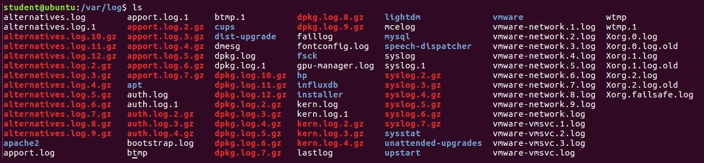

Lab 14. Working with Apache and Other Log Files
------------------------------------------------------------


In this lab, you are going to learn about log files. You will learn
how to parse log files. You will also learn why you need to write
exceptions in your programs. The different ways to parse different files
are also important. You will also learn about `ErrorLog` and
`AccessLog`. Finally, you will learn about how to parse other
log files.

In this lab, you will learn the following:


-   Parsing complex log files
-   The need for exceptions
-   Tricks for parsing different files
-   Error log
-   Access log
-   Parsing other log files


Parsing complex log files
--------------------------------------------


First, we are going to examine the concept of
parsing complex log files. Parsing log files is a challenging task
because most log files are in plain text format, and that format does
not follow any rules. Those files may be modified without showing any
warning. The user can decide what kind of data they are going to store
in a log file and in which format, as well as who is going to develop
the application.

Before moving on to an example of log parsing or changing configurations
in a log file, first we have to understand what we have got in a typical
log file. According to that we have to decide, we will learn how to
manipulate or get the information from it. We can also look for common
terms in the log file so that we can use those common terms to fetch
data.

 

Generally, you will see that most of the content generated in a log file
is by the application containers and also either the entries of system
access state (in other words, logging off and logging on) or the entries
of a system accessed over a network. Therefore, when your system is
accessed over a network remotely, the entry of such a remote connection
will be saved into a log file. Let\'s take an example for such
condition. We already have a file named `access.log`  with
some log information. 

So, let\'s create a `read_apache_log.py`script and write the
following content in it:


```
def read_apache_log(logfile):
            with open(logfile) as f:
                        log_obj = f.read()
                        print(log_obj)

if __name__ == '__main__':
            read_apache_log("access.log")
```

Run the script and you will get the output as follows:


```
student@ubuntu:~$ python3 read_apache_log.py
Output:
64.242.88.10 - - [07/Mar/2004:16:05:49 -0800] "GET /twiki/bin/edit/Main/Double_bounce_sender?topicparent=Main.ConfigurationVariables HTTP/1.1" 401 12846
64.242.88.10 - - [07/Mar/2004:16:06:51 -0800] "GET /twiki/bin/rdiff/TWiki/NewUserTemplate?rev1=1.3&rev2=1.2 HTTP/1.1" 200 4523
64.242.88.10 - - [07/Mar/2004:16:10:02 -0800] "GET /mailman/listinfo/hsdivision HTTP/1.1" 200 6291
64.242.88.10 - - [07/Mar/2004:16:11:58 -0800] "GET /twiki/bin/view/TWiki/WikiSyntax HTTP/1.1" 200 7352
64.242.88.10 - - [07/Mar/2004:16:20:55 -0800] "GET /twiki/bin/view/Main/DCCAndPostFix HTTP/1.1" 200 5253
64.242.88.10 - - [07/Mar/2004:16:23:12 -0800] "GET /twiki/bin/oops/TWiki/AppendixFileSystem?template=oopsmore&param1=1.12&param2=1.12 HTTP/1.1" 200 11382
64.242.88.10 - - [07/Mar/2004:16:24:16 -0800] "GET /twiki/bin/view/Main/PeterThoeny HTTP/1.1" 200 4924
64.242.88.10 - - [07/Mar/2004:16:29:16 -0800] "GET /twiki/bin/edit/Main/Header_checks?topicparent=Main.ConfigurationVariables HTTP/1.1" 401 12851
64.242.88.10 - - [07/Mar/2004:16:30:29 -0800] "GET /twiki/bin/attach/Main/OfficeLocations HTTP/1.1" 401 12851
64.242.88.10 - - [07/Mar/2004:16:31:48 -0800] "GET /twiki/bin/view/TWiki/WebTopicEditTemplate HTTP/1.1" 200 3732
64.242.88.10 - - [07/Mar/2004:16:32:50 -0800] "GET /twiki/bin/view/Main/WebChanges HTTP/1.1" 200 40520
64.242.88.10 - - [07/Mar/2004:16:33:53 -0800] "GET /twiki/bin/edit/Main/Smtpd_etrn_restrictions?topicparent=Main.ConfigurationVariables HTTP/1.1" 401 12851
64.242.88.10 - - [07/Mar/2004:16:35:19 -0800] "GET /mailman/listinfo/business HTTP/1.1" 200 6379
…..
```

In the preceding example, we created
one `read_apache_log`function to read Apache log files. Within
that, we opened a log file and then printed the log entries in it. After
defining the `read_apache_log()` function, we called it in the
main function with the Apache log file\'s name. In our case, the Apache
log file is named `access.log`**.**

After reading log entries in the `access.log` file, now we are
going to parse the IP addresses from the log file. For that, create
a `parse_ip_address.py`script and write the following content
in it:


```
import re
from collections import Counter

r_e = r'\d{1,3}\.\d{1,3}\.\d{1,3}\.\d{1,3}'
with open("access.log") as f:
            print("Reading Apache log file")
            Apache_log = f.read()
            get_ip = re.findall(r_e,Apache_log)
            no_of_ip = Counter(get_ip)
            for k, v in no_of_ip.items():
                        print("Available IP Address in log file " + "=> " + str(k) + " " + "Count "  + "=> " + str(v))
```

Run the script and you will get the output as follows:


```
student@ubuntu:~/work/Lab_15$ python3 parse_ip_address.py
Output:
Reading Apache log file
Available IP Address in log file => 64.242.88.1 Count => 452
Available IP Address in log file => 213.181.81.4 Count => 1
Available IP Address in log file => 213.54.168.1 Count => 12
Available IP Address in log file => 200.160.249.6 Count => 2
Available IP Address in log file => 128.227.88.7 Count => 14
Available IP Address in log file => 61.9.4.6 Count => 3
Available IP Address in log file => 212.92.37.6 Count => 14
Available IP Address in log file => 219.95.17.5 Count => 1
3Available IP Address in log file => 10.0.0.1 Count => 270
Available IP Address in log file => 66.213.206.2 Count => 1
Available IP Address in log file => 64.246.94.1 Count => 2
Available IP Address in log file => 195.246.13.1 Count => 12
Available IP Address in log file => 195.230.181.1 Count => 1
Available IP Address in log file => 207.195.59.1 Count => 20
Available IP Address in log file => 80.58.35.1 Count => 1
Available IP Address in log file => 200.222.33.3 Count => 1
Available IP Address in log file => 203.147.138.2 Count => 13
Available IP Address in log file => 212.21.228.2 Count => 1
Available IP Address in log file => 80.58.14.2 Count => 4
Available IP Address in log file => 142.27.64.3 Count => 7
……
```

In the preceding example, we created the Apache log parser to determine
some specific IP addresses with their number of requests on your server.
So, it is clear that we don\'t want entire log entries in the Apache log
file, we just want to fetch IP addresses from the log file. To do that,
we have to define a pattern to search IP addresses, and we can do that
by using regular expressions. Because of that, we imported
the `re` module. Then we imported the `Collection`
module as the alternative to Python\'s built-in datatypes,
`dict`, `list`, `set`, and
`tuple`. This module has specialized container datatypes.
After importing the required modules, we write a pattern using a regular
expression to match specific conditions to map IP addresses from the log
file.

In that matching pattern, `\d` can be any numeric digit
between `0` to `9` and `\r` stands for raw
string. Then, we opened the Apache log file named `access.log`
and read it. After that, we applied a regular expression condition on
the Apache log file, then uses the `counter` function of
`collection` module to get a count of each IP address that we
are fetching on the basis of the `re` conditions. Finally, we
printed the result of the operation, as we can see in the output.


The need for exceptions
------------------------------------------


In this section, we are going to look at the need for exceptions in
Python programming. The normal program flow consists of events and
signals. The term exception revels that there is something wrong with
your program. These exceptions can be of any type, such as zero division
error, import error, attribute error, or assertion error. These
exceptions will occur whenever the specified functions cannot perform
their tasks properly. The moment the exception occurs the program
execution stops and the interpreter will proceed with the exception
handling process. The exception handling process consists of writing
your code in  a `try…except` block. The reason the exception
handling is that something unexpected happened in your program.

 


### Analyzing exceptions


In this section, we are going to understand
analyzing exceptions. Every exception that occurs must be handled. Your
log files should also contain few exceptions. If you are getting similar
types of exceptions a number of times, then your program has some issue
and you should make the necessary changes as soon as possible.

Consider the following example:


```
f = open('logfile', 'r')
print(f.read())
f.close()
```

After running the program, you get the output as follows:


```
Traceback (most recent call last):
  File "sample.py", line 1, in <module>
    f = open('logfile', 'r')
FileNotFoundError: [Errno 2] No such file or directory: 'logfile'
```

In this example, we are trying to read a file that is not present in our
directory and as a result it shows an error. So, from the error we can
analyze what kind of solution we have to provide. To handle such a case,
we can use an exception handling technique. So, let\'s see an example of
handling errors using an exception handling technique.

Consider the following example:


```
try:
    f = open('logfile', 'r')
    print(f.read())
    f.close()
except:
    print("file not found. Please check whether the file is present in your directory or not.")
```

After running the program, you get the output as follows:


```
file not found. Please check whether the file is present in your directory or not.
```

 

 

In this example, we are trying to read a file that is not present in our
directory. But, as we used a file exception technique in this example,
we put our code in `try:` and `except:` blocks. So,
if any error or exception occurs in a `try:` block, it will
skip that error and execute the code in an `except:` block. In
our case, we just put a `print` statement in an
`except:` block. Therefore, after running the script, when the
exception occurs in the `try:` block, it skips that exception
and executes the code in the `except:` block. So,
the`print`statement in the `except` block gets
executed, as we can see in the previous output.


Tricks for parsing different files
-----------------------------------------------------


In this section, we are going to learn about the tricks to use to parse
different files. Before we start with the actual parsing, we must read
the data first. You need to understand where
you will be getting all the data from. But, you must also remember all
the log files come in different sizes. To make your task simpler, here
is a list to follow:


-   Remember the log files can be either plain text or compressed.
-   All the Log files have a `.log` extension for a plain text
    file and `log.bz2` for a `bzip2` file.
-   You should process the set of files based on their name.
-   All the parsing of log files must be combined into a single report.
-   The tool you are using must operate on all files, from a specified
    directory or from different directories. Log files from all
    sub-directories should also be included.** **


Error log
----------------------------


In this section, we are going to learn about the error log. The related
directives for the error log are as follows:


-   `ErrorLog`
-   `LogLevel`
:::

The location and the name of server log files are set[]{#id326367550
.indexterm} by the `ErrorLog` directive. It is the most
important log file. The Apache `httpd` sends the information
in this and also records produced while processing. Whenever a problem
occurs with the server, this will be the first place to look. It
contains the details of the things that went wrong and the process of
fixing it.

 

The error log is written into a file. On Unix systems, the errors can be
sent to `syslog` by the server or you can pipe them to your
program. The first thing in that log entry is the date and time of the
message. The second entry records the severity of the error.

The `LogLevel` directive handles the errors sent to the error
log by restricting the severity level. The third entry contains the
information about the client who generated the error. That information
will be the IP address. The next will be the message itself. It contains
the information that the server has been configured to deny the client
access. The server will then report the filesystem path of the requested
document.

The various types of message can appear in the error log files. The
error log file also contains the debugging output from CGI scripts.
Whatever the information is written into the `stderr` will be
directly copied to the error log.

The error log file is not customizable. The entries in the error log
that deals with the requests will have corresponding entries in the
access log. You should always monitor the error log for the problems
during testing. On Unix systems, you can run the following command to
accomplish this:


```
$ tail -f error_log
```


Access log
-----------------------------


In this section, you are going to learn about
the access log. The server access log will record all the requests
processed by the server. The `CustomLog` directive controls
the location and content of the access log. The
`LogFormat` directive is used to select the contents of the
logs.

Storing the information in the access log means starting log management.
The next step will be analyzing the information that helps us get useful
statistics. The Apache `httpd` has various versions, and these
versions have used some other modules and directives to control access
logging. You can configure the format of the access log. This format is
specified using a format string.


### Common log format


In this section, we are going to learn about
common log format. The following syntax shows the configuration for the
access log:


```
            LogFormat "%h %l %u %t \"%r\" %>s %b" nick_name
             CustomLog logs/access_log nick_name
```

 

This string will define a nickname and then it will associate that
nickname with the log format string. The log format string is made of
percent directives. Each percent directive tells the server to log
specific information. This string may contain literal characters. Those
characters will get copied directly in log output.

The `CustomLog` directive will set up a new log file with the
help of a defined [*nickname*]. The filename for the access
log is relative to the `ServerRoot`, unless it begins with a
slash.

The configuration we stated previously will write the log entries in a
**Common Log Format** (**CLF**). This is a
standard format and can be produced by many different web servers. Many
log analysis programs read this log format.

Now, we will see what each percent directive means:


-   `%h`:** **This shows us the IP address of the
    client who made the request to the web server. If
    `HostnameLookups` is on, then the server will determine
    the hostname and will log it in place of the IP address.
-   `%l`: This term is used to indicate that the information
    is not available for a requested piece.
-   `%u`:** **This is the user ID of the person who
    has requested the document. The same value is provided to CGI
    scripts in the `REMOTE_USER` environment variable.
-   `%t`:** **This term is used to detect the time
    at which the processing request of server is finished. The format is
    as follows:

```
[day/month/year:hour:minute:second zone]
```

For the `day` parameter, it takes two digits. For
`month`, we have to define three letters. For year, as the
year has four characters, we have to take four digits. Now after
`day`, `month`, and `year`, we have to
take two digits each for `hour`, `minute`, and
`seconds`.


-   ** **`\"%r\"`: This term is used as the request
    line, which is given in double quotes from the client. This request
    line has useful information. The request client uses the
    `GET` method and the protocol used is HTTP.
-   `%>s`: This term defines the status code for the client.
    The status code is very important and useful, because it indicates
    whether the request sent by the client is successfully made to the
    server or not.
-   `%b`: This term defines the total size of the object when
    it returns to the client. This total size does not include the size
    of the response header.


Parsing other log files
------------------------------------------


There are also different log files available
within our system, including Apache log. In our Linux distribution, the
log files are in the `/var/log/` folder within the root
filesystem as shown here:



:::

In the preceding screenshot, we can easily see the different types of
log files (for instance, authentication log file `auth.log`,
system log file `syslog`, and kernel log `kern.log`)
available for different operations entries. As we perform operations on
Apache log files, as shown previously, we can also perform the same kind
of operations on local log files. Let\'s see an example for parsing one
of the log files from before. Create
a `simple_log.py`script and write the following content in it:


```
f=open('/var/log/kern.log','r')

lines = f.readlines()
for line in lines:
            kern_log = line.split()
            print(kern_log)
f.close()
```

Run the script and you will get the output as follows:


```
student@ubuntu:~$ python3 simple_log.py
Output:
 ['Dec', '26', '14:39:38', 'ubuntu', 'NetworkManager[795]:', '<info>', '[1545815378.2891]', 'device', '(ens33):', 'state', 'change:', 'prepare', '->', 'config', '(reason', "'none')", '[40', '50', '0]']
['Dec', '26', '14:39:38', 'ubuntu', 'NetworkManager[795]:', '<info>', '[1545815378.2953]', 'device', '(ens33):', 'state', 'change:', 'config', '->', 'ip-config', '(reason', "'none')", '[50', '70', '0]']
['Dec', '26', '14:39:38', 'ubuntu', 'NetworkManager[795]:', '<info>', '[1545815378.2997]', 'dhcp4', '(ens33):', 'activation:', 'beginning', 'transaction', '(timeout', 'in', '45', 'seconds)']
['Dec', '26', '14:39:38', 'ubuntu', 'NetworkManager[795]:', '<info>', '[1545815378.3369]', 'dhcp4', '(ens33):', 'dhclient', 'started', 'with', 'pid', '5221']
['Dec', '26', '14:39:39', 'ubuntu', 'NetworkManager[795]:', '<info>', '[1545815379.0008]', 'address', '192.168.0.108']
['Dec', '26', '14:39:39', 'ubuntu', 'NetworkManager[795]:', '<info>', '[1545815379.0020]', 'plen', '24', '(255.255.255.0)']
['Dec', '26', '14:39:39', 'ubuntu', 'NetworkManager[795]:', '<info>', '[1545815379.0028]', 'gateway', '192.168.0.1']
```

In the preceding example, first we created one simple file object,
`f`, and opened the `kern.log` file in it with read
mode. After that, we applied the `readlines()` function over
`file` object to read the data in the file line-by-line in the
`for` loop. Then we applied
the **`split()`** function on each line of the
kernel log file and then printed the whole file using the
`print` function, as can be seen in the output.

Like reading the kernel log file, we can also perform various operations
on it, just like we are going to perform some operations now. Now, we
are going to access content in the kernel log file through indexing. It
is possible because of the `split` function, as it splits all
the information in the file as a different iteration. So, let\'s see an
example of such a condition. Create a `simple_log1.py` script
and put the following script in it:


```
f=open('/var/log/kern.log','r')

lines = f.readlines()
for line in lines:
            kern_log = line.split()[1:3]
            print(kern_log)
```

Run the script and you will get the following output:


```
student@ubuntu:~$ python3 simple_log1.py
Output:
['26', '14:37:20']
['26', '14:37:20']
['26', '14:37:32']
['26', '14:39:38']
['26', '14:39:38']
['26', '14:39:38']
['26', '14:39:38']
['26', '14:39:38']
['26', '14:39:38']
['26', '14:39:38']
['26', '14:39:38']
['26', '14:39:38'] 
```

In the preceding example, we just added `[1:3]` next to the
`split` function, in other words, slicing. A sub-sequence of a
sequence is known as a slice and the operation that extracts a
sub-sequence is known as slicing. In our example, we use square brackets
(`[ ]`) as the slice operator and have two integer values
inside it, separated by a colon (`:`). The operator
`[1:3]` returns the part of the sequence from the first
element to the third element, including the first but excluding the
last. When we slice any sequence, the sub-sequence we got[]{#id326065748
.indexterm} always has the same type as the original sequence from which
it was derived. However, the elements of a list (or tuple) can be of any
type; no matter how we apply slicing over it, the derived slice of a
list is a list. So, after applying slicing on log file, as a result of
that we got the output shown previously.


Summary
--------------------------


In this lab, you learned about how to work with different types of
log files. You also learned about parsing complex log files and the need
for exceptions while handling these files. The tricks for parsing log
files will help in performing the parsing smoothly. You also learned
about `ErrorLog` and `AccessLog`.

In the next lab, you are going to learn about SOAP and REST
communication.


Questions
----------------------------


1.  What is the difference between runtime and compile time exceptions
    in Python?
2.  What are regular expressions?
3.  Explore the Linux commands `head`, `tail`,
    `cat`, and `awk`.
4.  Write a Python program to append the contents of one file to another
    file.
5.  Write a Python program to read the contents of a file in reverse
    order.
6.  What would be the output of the following expressions?
    a.  `re.search(r'C\Wke', 'C@ke').group()`
    b.  `re.search(r'Co+kie', 'Cooookie').group()`
    c.  `re.match(r'<.*?>', '<h1>TITLE</h1>').group()`
    


Further reading
----------------------------------


-   Python logging: <https://docs.python.org/3/library/logging.html>
-   Regular expression: <https://docs.python.org/3/howto/regex.html> 
-   Exception
    handling: [https://www.pythonforbeginners.com/error-handling/python-try-and-except ](https://www.pythonforbeginners.com/error-handling/python-try-and-except){.ulink}
