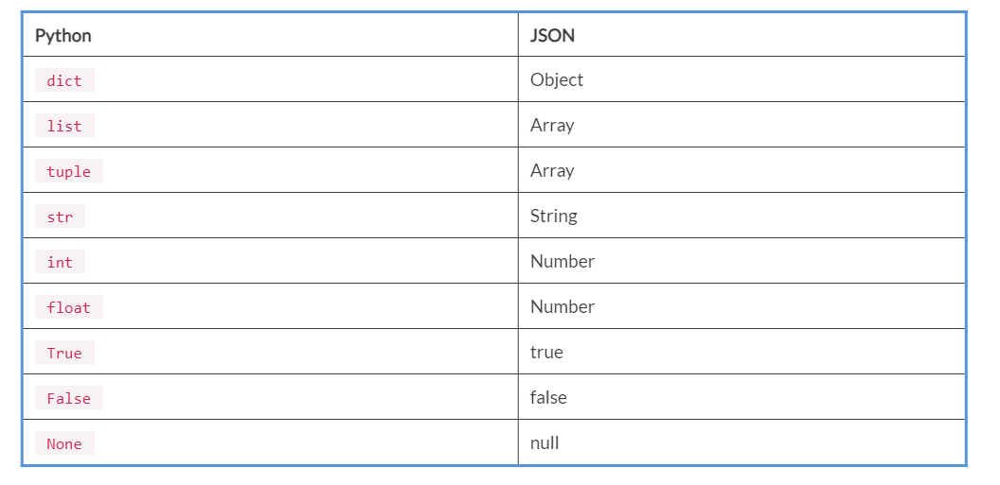

Lab 15. SOAP and REST API Communication
----------------------------------------------------


In this lab, we will look at SOAP and REST API basics. We will also
look at the Python libraries for SOAP and REST APIs. We are going to
learn about the Zeep library for SOAP and requests for REST API. You
will learn to work with the JSON data. We are going to see simple
examples of working with JSON data, such as converting JSON strings into
Python objects and converting Python objects into JSON strings.

In this lab, you will learn the following:


-   What is SOAP?
-   Using libraries for SOAP
-   What is a RESTful API?
-   Using standard libraries for RESTful API
-   Working with JSON data


#### Using libraries for SOAP


In this section, we are going to learn about
Python libraries for SOAP. There are various libraries used for SOAP
listed here:


-   `SOAPpy`
-   `Zeep`
-   `Ladon`
-   `suds-jurko`
-   `pysimplesoap`


The `Zeep` module is used for WSDL documents. It generates the
code for the services and the documents and provides the programming
interface to the SOAP server. The `lxml` library is used to
parse the XML documents.

Now, we are going to see an example. Create
a `soap_example.py`script and write the following code in it:


```
import zeep

w = 'http://www.soapclient.com/xml/soapresponder.wsdl'
c = zeep.Client(wsdl=w)
print(c.service.Method1('Hello', 'World'))
```

Run the script and you will get the following output:


```
student@ubuntu:~$ python3 soap_example.py
Output :
Your input parameters are Hello and World
```

In the preceding example, we first imported the `zeep` module.
We first mentioned the website name. Then we created the
`zeep` client object. The WSDL we used previously defines a
simple `Method1` function that is made available by
`zeep` via `client.service.Method1`. It takes two
arguments and returns a string.


What is a RESTful API?
-----------------------------------------


#### Using standard libraries for RESTful APIs


In this section, we are going to learn how to
use RESTful APIs. To do this, we are going to
use the `requests` and JSON modules of Python. We will see an
example now. First, we are going to use the `requests` module
to get the information from an API. We will see `GET` and
`POST` requests.

First, you must install the `requests` library as follows:


```
            $ pip3 install requests
```

Now, we will see an example. Create
a `rest_get_example.py`script and write the following content
in it:


```
import requests

req_obj = requests.get('https://www.imdb.com/news/top?ref_=nv_tp_nw')
print(req_obj)
```

Run the script and you will get the output as follows:


```
student@ubuntu:~/work$ python3 rest_get_example.py
Output:
<Response [200]>
```

 


Now, we are going to see the `POST` request example.
`POST` requests are used for sending data to a server. Create
a `rest_post_example.py`script and write the following content
in it:


```
import requests
import json

url_name = 'http://httpbin.org/post'
data = {"Name" : "John"}
data_json = json.dumps(data)
headers = {'Content-type': 'application/json'}
response = requests.post(url_name, data=data_json, headers=headers)
print(response)
```

Run the script and you will get the following output:


```
student@ubuntu:~/work$ python3 rest_post_example.py
Output:
<Response [200]>
```

In the preceding example, we learned about the `POST` request.
First, we imported the necessary module requests and JSON. Next, we
mentioned the URL. Also, we entered the data that we want to post in a
dictionary format. Next, we mentioned headers. And then we posted, using
a `POST` request. The output we got is status code
`200`, which is a success code.


Working with JSON data
-----------------------------------------

Now, we are going to see some examples using a JSON module. First, we
are going to see the conversion from JSON to Python. For that, create a
script `json_to_python.py` and write the following code in it:


```
import json

j_obj =  '{ "Name":"Harry", "Age":26, "Department":"HR"}'
p_obj = json.loads(j_obj)
print(p_obj["Name"])
print(p_obj["Department"])
```

Run the script and you will get the output as follows:


```
student@ubuntu:~/work$ python3 json_to_python.py
Output:
Harry
HR
```

In the preceding example, we have written a code that will covert a JSON
string to a Python object. The `json.loads()` function is used
to convert a JSON string to a Python object.

Now, we are going to see how to convert Python to JSON. For that, create
a `python_to_json.py`script and write the following code in
it:


```
import json

emp_dict1 =  '{ "Name":"Harry", "Age":26, "Department":"HR"}'
json_obj = json.dumps(emp_dict1)
print(json_obj)
```

Run the script and you will get the following output:


```
student@ubuntu:~/work$ python3 python_to_json.py
Output:
"{ \"Name\":\"Harry\", \"Age\":26, \"Department\":\"HR\"}"
```

 

 

In the preceding example, we converted a Python object to a JSON string.
The `json.dumps()` function is used for this conversion.

Now, we are going to see how to convert Python objects of various types
into the JSON string. For that, create
a `python_object_to_json.py`script and write the following
content in it:


```
import json

python_dict =  {"Name": "Harry", "Age": 26}
python_list =  ["Mumbai", "Pune"]
python_tuple =  ("Basketball", "Cricket")
python_str =  ("hello_world")
python_int =  (150)
python_float =  (59.66)
python_T =  (True)
python_F =  (False)
python_N =  (None)

json_obj = json.dumps(python_dict)
json_arr1 = json.dumps(python_list)
json_arr2 = json.dumps(python_tuple)
json_str = json.dumps(python_str)
json_num1 = json.dumps(python_int)
json_num2 = json.dumps(python_float)
json_t = json.dumps(python_T)
json_f = json.dumps(python_F)
json_n = json.dumps(python_N)

print("json object : ", json_obj)
print("json array1 : ", json_arr1)
print("json array2 : ", json_arr2)
print("json string : ", json_str)
print("json number1 : ", json_num1)
print("json number2 : ", json_num2)
print("json true", json_t)
print("json false", json_f)
print("json null", json_n)
```

Run the script and you will get the following output:


```
student@ubuntu:~/work$ python3 python_object_to_json.py
Output:
json object :  {"Name": "Harry", "Age": 26}
json array1 :  ["Mumbai", "Pune"]
json array2 :  ["Basketball", "Cricket"]
json string :  "hello_world"
json number1 :  150
json number2 :  59.66
json true true
json false false
json null null
```

In the preceding example, we converted various types of Python objects into JSON string using
the `json.dumps()` function. After conversion, the Python list
and tuples are converted into arrays. Integers and floats are treated as
numbers in JSON. The following is the chart of conversion from Python to
JSON:




Summary
--------------------------


In this lab, you learned about SOAP APIs and RESTful APIs. You
learned about the `zeep` Python library for SOAP APIs and the
requests library for REST APIs. You also learned to work with JSON data,
for instance, converting JSON to Python and vice versa.

In the next lab, you will learn about web scrapping and the Python
library for performing this task.


Questions
----------------------------


1.  What is the difference between SOAP and REST API?
2.  What is the difference between `json.loads` and
    `json.load`?
3.  Does JSON support all the platforms?

4.  What is the output of the following code snippet?

```
boolean_value = False
print(json.dumps(boolean_value))
```


5.  What is the output of the following code snippet?

```
>> weird_json = '{"x": 1, "x": 2, "x": 3}'
>>> json.loads(weird_json)
```

