Lab 17. Statistics Gathering and Reporting
-------------------------------------------------------


In this lab, you will learn about the advanced Python libraries used
in statistics for scientific calculations. You are going to learn about
the NumPY, Pandas, Matplotlib, and Plotly modules of Python. You will
learn about the data visualization techniques and also how to plot the
gathered data.

In this lab, we will cover the following topics:


-   NumPY module
-   Pandas module
-   Data visualization


NumPY module
-------------------------------


NumPY is a Python module that provides
efficient operations on arrays. NumPY is the fundamental package for
scientific computing with Python. This package is commonly used for
Python data analysis. A NumPY array is a grid of multiple values.

Install NumPY by running the following command in your Terminal:


```
$ pip3 install numpy
```

 

 

 

 

 

 

We are going to use this `numpy` library to do operations on
a `numpy` array. Now we are going to see how to create
`numpy` arrays. For that, create a script
called `simple_array.py` and write following code in it:


```
import numpy as np

my_list1 = [1,2,3,4]
my_array1 = np.array(my_list1)
print(my_list11, type(my_list1))
print(my_array1, type(my_array1))
```

Run the script and you will get the following output:


```
student@ubuntu:~$ python3 simple_array.py
```

The output is as follows:


```
[1, 2, 3, 4] <class 'list'>
[1 2 3 4] <class 'numpy.ndarray'>
```

In the preceding example, we have imported the `numpy` library
as `np` to use `numpy` functionality. Then we
created a simple list, which we converted into an array and for that we
used the **`np.array()`** function**.**
Finally, we printed the `numpy` array with type to easily
understand a normal array and a `numpy` array .

The previous example was of a single dimensional array. Now we are going
to look at an example of a multi-dimensional array. For that, we that we
have to create another list. Let\'s  look at another example. Create a
script called `mult_dim_array.py` and write the following
content in it:


```
import numpy as np

my_list1 = [1,2,3,4]
my_list2 = [11,22,33,44]

my_lists = [my_list1, my_list2]
my_array = np.array(my_lists)
print(my_lists, type(my_lists))
print(my_array, type(my_array))
```

Run the script and you will get the following output:


```
student@ubuntu:~$ python3 mult_dim_array.py
```

 

The output is as follows:


```
[[1, 2, 3, 4], [11, 22, 33, 44]] <class 'list'>
[[ 1 2 3 4]
 [11 22 33 44]] <class 'numpy.ndarray'>
```

In the preceding example, we imported the `numpy` module.
After that, we created two lists: `my_list1` and
`my_list2`. Then we made another list of lists
(`my_list1` and `my_list2`) and applied
the `np.array()` function on the list (`my_lists`)
and stored it in an object called `my_array`. Finally, we
printed the `numpy` array.

Now, we are going to look at more operations that can be done with an
array. We are going to study how to know the size as well as the data
type of our created array; that is, `my_array`. For that, we
just have to apply the `shape()` function and we will get the
`size` of the array and `dtype()` function to know
the `data type` of the array on our created array. Let\'s look
at an example of this. Create a script
called `size_and_dtype.py` and write the following in it:


```
import numpy as np

my_list1 = [1,2,3,4]
my_list2 = [11,22,33,44]

my_lists = [my_list1,my_list2]
my_array = np.array(my_lists)
print(my_array)

size = my_array.shape
print(size)

data_type = my_array.dtype
print(data_type)
```

Run the script and you will get the following output:


```
student@ubuntu:~$ python3 size_and_dtype.py
```

The output is as follows:


```
[[ 1  2  3  4]
 [11 22 33 44]]
(2, 4)
int64
```

 

 

 

 

In the preceding example, we applied the shape function as
`my_array.shape` to get the size of our array. The output
was `(2, 4)`. Then we applied the `dtype` function
as `my_array.dtype` on the array and the output was
`int64`**.**

Now, we are going to look at some examples of special case arrays.

First, we will make an array with all zeros using
the `np.zeros()` function, as shown here:


```
student@ubuntu:~$ python3
Python 3.6.7 (default, Oct 22 2018, 11:32:17)
[GCC 8.2.0] on linux
Type "help", "copyright", "credits" or "license" for more information.
>>> import numpy as np
>>> np.zeros(5)
array([0., 0., 0., 0., 0.])
>>> 
```

After making the array with all zeros, we are going to
make the array with all 1\'s using
the `np.ones()` function of `numpy`, as shown here:


```
>>> np.ones((5,5))
array([[1., 1., 1., 1., 1.],
       [1., 1., 1., 1., 1.],
       [1., 1., 1., 1., 1.],
       [1., 1., 1., 1., 1.],
       [1., 1., 1., 1., 1.]])
>>> 
```

`np.ones((5,5))` creates an array of `5*5` with all
values being `1`.

Now, we are going to make an empty array using
the `np.empty()` function of `numpy`, as shown here:


```
>>> np.empty([2,2])
array([[6.86506982e-317,  0.00000000e+000],
       [6.89930557e-310,  2.49398949e-306]])
>>> 
```

`np.empty()` does not set the array values to zero, like
the `np.zeros()` function does. Therefore, it may be faster.
Besides, it requires the user to enter all the values manually in the
array and should therefore be used with caution.

Now, let\'s see how to make an identity array using
the `np.eye()` function, which results in the array with its
diagonal value `1`, as shown here:


```
>>> np.eye(5)
array([[1., 0., 0., 0., 0.],
       [0., 1., 0., 0., 0.],
       [0., 0., 1., 0., 0.],
       [0., 0., 0., 1., 0.],
       [0., 0., 0., 0., 1.]])
>>> 
```

Now, we are going to see the `range` function, which is used
to create an array using the `np.arange()` function of
`numpy`, as shown here:


```
>>> np.arange(10)
array([0, 1, 2, 3, 4, 5, 6, 7, 8, 9])
>>> 
```

`The np.arange(10)` function creates the array of range
`0-9`. We defined the range value `10`, and because
of that, the array index value starts with `0`.


### Using arrays and scalars


In this section, we are going to look at various arithmetic
operations on arrays using `numpy`.
For that, first we will create a
multidimensional array, as follows:


```
student@ubuntu:~$ python3
Python 3.6.7 (default, Oct 22 2018, 11:32:17)
[GCC 8.2.0] on linux
Type "help", "copyright", "credits" or "license" for more information.
>>> import numpy as np
>>> from __future__ import division
>>> arr = np.array([[4,5,6],[7,8,9]])
>>> arr
array([[4, 5, 6],
       [7, 8, 9]])
>>> 
```

Here, we imported the `numpy` module to use
the `numpy` functionality, and then we imported
the `__future__` module that will take care of floats. After
that, we created a two dimensional array, `arr`, to perform
various operations on it.

 

Now, let\'s look at some arithmetic operations on arrays. First, we will
study the multiplication of arrays, as shown here:


```
>>> arr*arr
array([[16, 25, 36],
       [49, 64, 81]])
>>> 
```

In the preceding multiplication operation**,** we multiplied
the `arr` array twice to get a multiplied array. You can also
multiply two different arrays.

Now, we are going to look at a subtraction operation on an array, as
shown here:


```
>>> arr-arr
array([[0, 0, 0],
       [0, 0, 0]])
>>> 
```

As shown in the preceding example, we just use
the  `-` operator to do the subtraction of two arrays. After
the subtraction of the arrays, we got the resultant array, as shown in
the preceding code.

Now we are going to look at arithmetic operations on arrays with
scalars. Let\'s look at some operations:


```
>>> 1 / arr
array([[0.25             ,  0.2        ,   0.16666667],
       [0.14285714 ,   0.125     ,  0.11111111]])
>>> 
```

In the preceding example, we divided `1` by our array and got
the output. Remember, we imported the `__future__` module,
which is actually useful for such operations, to take care of float
values in the array.

Now we will look at the exponential operation on the `numpy`
array, as shown here:


```
>>> arr ** 3
array([[ 64, 125, 216],
       [343, 512, 729]])
>>> 
```

In the preceding example, we took a cube of our array and it gave the
output as the cube of each value in the array.

 

 


### Array indexing


The indexing of arrays is done using an array as an index. With an
index array, a copy of the original array is
returned. `numpy` arrays can be indexed using any other
sequence or by using any other array, excluding tuples. The last element
in the array can be indexed by `-1` and the second last
element can be indexed by `-2`, and so on.

So, to perform indexing operations on the  array, first we
create a new `numpy` array and for
that we are going to use the `range()` function to create the
array, as shown here:


```
student@ubuntu:~$ python3
Python 3.6.7 (default, Oct 22 2018, 11:32:17)
[GCC 8.2.0] on linux
Type "help", "copyright", "credits" or "license" for more information.
>>> import numpy as np
>>> arr = np.arange(0,16)
>>> arr
array([ 0,  1,  2,  3,  4,  5,  6,  7,  8,  9, 10, 11, 12, 13, 14, 15])
>>>
```

In the preceding example, we created the array `arr` with the
range `16`; that is, `0-15`.

Now, we are going to perform a different indexing operation on array
`arr`. First, let\'s get the value in the array at a
particular index:


```
>>> arr[7]
7
>>> 
```

In the preceding example, we accessed the array by its index value and
after passing the index number to the array `arr`, the array
returned the value `7`, which is the particular indexed number
that we pass.

After getting the value at a particular index, we are going to get
values in a range. Let\'s look at the following example:


```
>>> arr[2:10]
array([2, 3, 4, 5, 6, 7, 8, 9])
>>> arr[2:10:2]
array([2, 4, 6, 8])
>>>
```

 

 

 

 

 

 

 

 

 

In the preceding example, first we accessed the array and got values in
a range of (`2-10`). As a result, it shows the output as
`array([2, 3, 4, 5, 6, 7, 8, 9])`. In the second
term, `arr[2:10:2]`, it actually states that access array in
the range of `2-10` in the interval of two step. The syntax of
this kind of indexing is
`arr[_start_value_:_stop_value_:_steps_]`. So, as the output
of second term, we get `array([2, 4, 6, 8])`.

We can also get values in the array from the index until the end, as
show in the following example:


```
>>> arr[5:]
array([ 5,  6,  7,  8,  9, 10, 11, 12, 13, 14, 15])
>>> 
```

As we seen in the preceding example, we accessed the values in the array
from the 5th index value until the end. As a result, we got the output
as `array([ 5,  6,  7,  8,  9, 10, 11, 12, 13, 14, 15])`.

Now we are going to look at slicing of the `numpy` array. In
slicing, we actually take some part of our original array and store it
in a specified array name. Let\'s look at an example:


```
>>> arr_slice = arr[0:8]
>>> arr_slice
array([0, 1, 2, 3, 4, 5, 6, 7])
>>> 
```

In the preceding example, we take slice of the original array. As a
result, we got a slice of the array with values `0,1,2,…..,7`.
We can also give updated values to the slice of the array. Let\'s look
at an an example:


```
>>> arr_slice[:] = 29
>>> arr_slice
array([29, 29, 29, 29, 29, 29, 29, 29])
>>>  
```

In the the preceding example, we set all values in the array slice to
`29,`. But the important thing while assigning values to the
array slice is that the value assigned to the slice will also get
assigned to the original set of the array.

Let\'s see the result after giving values to the slice of the array and
the effect on our original array:


```
>>> arr
array([29, 29, 29, 29, 29, 29, 29, 29,  8,  9, 10, 11, 12, 13, 14, 15])
>>>
```

 

 

 

Now, we are going to look at another operation; that is, copying the
array. The difference between slicing and copying of arrays is that when
we do the slicing of the array, the changes made are going to be applied
on the original array. When we get a copy of the array, it gives an
explicit copy of the original array. Therefore, the changes applied onto
the copy of the array do not affect the original array. So let\'s look
at an example of copying an array:


```
>>> cpying_arr = arr.copy()
>>> cpying_arr
array([29, 29, 29, 29, 29, 29, 29, 29,  8,  9, 10, 11, 12, 13, 14, 15])
>>> 
```

In the preceding example, we just take a copy of the original array. For
that, we use the `array_name.copy()` function and the output
is the copy the original array.


#### Indexing a 2D array


A 2D array is an array of arrays. In this, the position[]{#id326845208
.indexterm} of the data element normally refers to two indices instead
of one and it represents the table with rows and columns of data. Now we
are going to do indexing of such a type of arrays.

So, let\'s look at an example of a 2D array:


```
>>> td_array = np.array(([5,6,7],[8,9,10],[11,12,13]))
>>> td_array
array([[  5,   6,    7],
       [  8,   9,  10],
       [11, 12,  13]])
>>>  
```

In the preceding example, we created a 2D array named
`td_array`. After creating an array, we printed
`td_array`. Now we are also going to fetch the values in
`td_array` through indexing. Let\'s look at an example to
access values through indexing:


```
>>> td_array[1]
array([ 8,  9, 10])
>>>
```

 

 

 

In the preceding example, we accessed the first index value of the array
and we got the output. In such a type of indexing, when we access the
value, we get the whole array. Instead of getting the whole array, we
can also get access to particular value. Let\'s look at an example:


```
>>> td_array[1,0]
8
>>> 
```

In the preceding example, we accessed `td_array` by passing
two values for the row and column. As seen in the output, we got the
value `8`.

We can also set up the two-dimensional array in a different way. First,
set our 2D array with increased length. Let\'s set the length to
`10`. So, for that, we create a sample array with all zeros in
it and, after that, we are going to put values in it. Let\'s look at an
example:


```
>>> td_array = np.zeros((10,10))
>>> td_array
array([[0., 0., 0., 0., 0., 0., 0., 0., 0., 0.],
       [0., 0., 0., 0., 0., 0., 0., 0., 0., 0.],
       [0., 0., 0., 0., 0., 0., 0., 0., 0., 0.],
       [0., 0., 0., 0., 0., 0., 0., 0., 0., 0.],
       [0., 0., 0., 0., 0., 0., 0., 0., 0., 0.],
       [0., 0., 0., 0., 0., 0., 0., 0., 0., 0.],
       [0., 0., 0., 0., 0., 0., 0., 0., 0., 0.],
       [0., 0., 0., 0., 0., 0., 0., 0., 0., 0.],
       [0., 0., 0., 0., 0., 0., 0., 0., 0., 0.],
       [0., 0., 0., 0., 0., 0., 0., 0., 0., 0.]])
>>> for i in range(10):
    ...     td_array[i] = i
    ...
>>> td_array
array([[0., 0., 0., 0., 0., 0., 0., 0., 0., 0.],
       [1., 1., 1., 1., 1., 1., 1., 1., 1., 1.],
       [2., 2., 2., 2., 2., 2., 2., 2., 2., 2.],
       [3., 3., 3., 3., 3., 3., 3., 3., 3., 3.],
       [4., 4., 4., 4., 4., 4., 4., 4., 4., 4.],
       [5., 5., 5., 5., 5., 5., 5., 5., 5., 5.],
       [6., 6., 6., 6., 6., 6., 6., 6., 6., 6.],
       [7., 7., 7., 7., 7., 7., 7., 7., 7., 7.],
       [8., 8., 8., 8., 8., 8., 8., 8., 8., 8.],
       [9., 9., 9., 9., 9., 9., 9., 9., 9., 9.]])
>>>
```

 

 

 

 

In the preceding example, we created one two-dimensional array with the
length `10` by `10`.

Now let\'s do some fancy indexing on it, as shown in the
following example:


```
>>> td_array[[1,3,5,7]]
array([[1., 1., 1., 1., 1., 1., 1., 1., 1., 1.],
       [3., 3., 3., 3., 3., 3., 3., 3., 3., 3.],
       [5., 5., 5., 5., 5., 5., 5., 5., 5., 5.],
       [7., 7., 7., 7., 7., 7., 7., 7., 7., 7.]])
>>> 
```

In the preceding example, we fetch particular index values. So, in the
result, we got the output.

### Universal array functions


Universal functions perform the operations on
all the elements in a `numpy` array. Now, we are going to look
at an example to perform multiple universal functions on an array.
First, we are going to take the square root of the array. Create a
script called `sqrt_array.py` and write the following content
in it:


```
import numpy as np

array = np.arange(16)
print("The Array is : ",array)
Square_root = np.sqrt(array)
print("Square root of given array is : ", Square_root)
```

Run the script and you will get the following output:


```
student@ubuntu:~/work$ python3 sqrt_array.py
```

The output is as follows:


```
The Array is : [ 0 1 2 3 4 5 6 7 8 9 10 11 12 13 14 15]
Square root of given array is : [0. 1. 1.41421356 1.73205081 2. 2.23606798
 2.44948974 2.64575131 2.82842712 3. 3.16227766 3.31662479
 3.46410162 3.60555128 3.74165739 3.87298335]
```

 

 

In the preceding example, we created one simple array using range as a
function of `numpy`. Then we applied the `sqrt()`
function on the generated array to get the square root of the array.
After taking the square root of the array, we are going to apply another
universal function on the array, which is the exponential
`exp()` function. Let\'s look at an example. Create a script
called `expo_array.py` and write the following content in it:


```
import numpy as np

array = np.arange(16)
print("The Array is : ",array)
exp = np.exp(array)
print("exponential of given array is : ", exp)
```

Run the script and you will get the following output:


```
student@ubuntu:~/work$ python3 expo_array.py
```

The output is as follows:


```
The Array is :  [ 0  1  2  3  4  5  6  7  8  9 10 11 12 13 14 15]
exponential of given array is :  [1.00000000e+00 2.71828183e+00 7.38905610e+00 2.00855369e+01
 5.45981500e+01 1.48413159e+02 4.03428793e+02 1.09663316e+03
 2.98095799e+03 8.10308393e+03 2.20264658e+04 5.98741417e+04
 1.62754791e+05 4.42413392e+05 1.20260428e+06 3.26901737e+06]
```

In the preceding example, we created one simple array using the
`range` function of `numpy`. Then we applied
the  `exp()` function on the generated array to get the
exponential of the array.


Pandas module
--------------------------------


In this section, we are going to learn about
the pandas module. The pandas module provides fast and flexible data
structures that are designed for working with structured and time series
data. The pandas module is used for data analysis. The pandas module is
built on packages such as NumPY and Matplotlib and gives us a place to
do most of our analysis and visualization work in. To use the
functionality of this module, you must import it first.

First, install the following packages that we need in our examples by
running the following commands:


```
$ pip3 install pandas
$ pip3 install matplotlib
```

 

 

 

 

Here, we are going to look at some examples of using the pandas module.
We will learn about two data structures: Series and DataFrames. We are
also going to see how we can read the data from a `csv` file
using pandas.


### Series


The pandas series is a one-dimensional array. It can hold
any data type. The labels are referred to as
the index. Now, we are going to look at an example of series without
declaring an index and series with declaring an index. First, we will
look at an example of series without declaring an index. For that,
create a script called  `series_without_index.py` and write
the following content in it:


```
import pandas as pd
import numpy as np

s_data = pd.Series([10, 20, 30, 40], name = 'numbers')
print(s_data)
```

Run the script and you will get the following output:


```
student@ubuntu:~/work$ python3 series_without_index.py
```

The output is as follows :


```
0 10
1 20
2 30
3 40
Name: numbers, dtype: int64
```

In the preceding example, we learned about series without declaring an
index. First, we imported two modules: pandas and `numpy`.
Next, we created the `s_data` object that will store the
series data. In that series, we created a list and instead of declaring
an index, we provided the name attribute, which will give a name to the
list, and then we printed the data. In the output, the left column is
your index for the data. Even if we never provide the index, pandas will
give it implicitly. The index will always start from `0`.
Underneath the columns is the name of our series and the data type of
the values.

 

Now, we are going to look at an example of a series when declaring an
index. Here we are also going to perform indexing and slicing
operations. For that, create a script
called `series_with_index.py` and write the following content
in it:


```
import pandas as pd
import numpy as np

s_data = pd.Series([10, 20, 30, 40], index = ['a', 'b', 'c', 'd'], name = 'numbers')
print(s_data)
print()
print("The data at index 2 is: ", s_data[2])
print("The data from range 1 to 3 are:\n", s_data[1:3])
```

Run the script and you will get the following output:


```
student@ubuntu:~/work$ python3 series_with_index.py
a    10
b    20
c    30
d    40
Name: numbers, dtype: int64


The data at index 2 is:  30
The data from range 1 to 3 are:
 b    20
c    30
Name: numbers, dtype: int64
```

In the preceding example, we provided an index value for our data in the
`index` attribute. In the output, the left column is the index
values that we provided.


### DataFrames


In this section, we are going to learn about
pandas DataFrames. DataFrames are two-dimensional labeled data
structures that have columns and may be of different data types.
DataFrames are similar to SQL tables or a spreadsheet. They are the most
common object when working with pandas.

 

Now, we are going to look at an example of reading data from a
`csv` file into a DataFrame. For that, you must have a
`csv` file present in your system. If you don\'t have
a `csv` file in your system, create a file
named `employee.csv`, as follows:


```
Id, Name, Department, Country
101, John, Finance, US
102, Mary, HR, Australia
103, Geeta, IT, India
104, Rahul, Marketing, India
105, Tom, Sales, Russia
```

Now, we are going to read this `csv` file into a DataFrame.
For that, create a script called `read_csv_dataframe.py` and
write the following content in it:


```
import pandas as pd

file_name = 'employee.csv'
df = pd.read_csv(file_name)
print(df)
print()
print(df.head(3))
print()
print(df.tail(1))
```

Run the script and you will get the following output:


```
student@ubuntu:~/work$ python3 read_csv_dataframe.py
Output:
    Id    Name  Department     Country
0  101    John     Finance          US
1  102    Mary          HR   Australia
2  103   Geeta          IT       India
3  104   Rahul   Marketing       India
4  105     Tom       Sales      Russia


    Id    Name  Department     Country
0  101    John     Finance          US
1  102    Mary          HR   Australia
2  103   Geeta          IT       India

    Id  Name  Department  Country
4  105   Tom       Sales   Russia
```

 

In the preceding example, we first created a `csv` file
called `employee.csv`. We are using the pandas module to
create data frames. The goal is to read that `csv` file into
the DataFrame. Next, we created a `df`object and we are
reading the contents of a `csv` file into it. Next we are
printing a DataFrame. Here, we used the `head()` and
`tail()` methods to get the particular number of lines of
data. We specified `head(3)`, which means we are printing the
first three lines of data. We also specified `tail(1)`, which
means we are printing the last line of data.


Data visualization
-------------------------------------


Data visualization is the term that describes
the efforts in understanding the significance of data, placing it in a
visual manner. In this section, we are going to look at the following
data visualization techniques:


-   Matplotlib
-   Plotly


### Matplotlib


Matplotlib is the data visualization library
in Python and it allows us to generate plots, histograms, power spectra,
bar charts, error charts, scatter plots, and so on, using a
few lines of code. Matplotlib usually make
things easier and the hardest things possible.

To use `matplotlib` in your Python program, first we have to
install `matplotlib`. Run the following command in your
Terminal to install `matplotlib:`


```
$ pip3 install matplotlib
```

Now, you have to install one more package, `tkinter`, for
graphical representations. Install it using the following command:


```
$ sudo apt install python3-tk
```

Now that `matplotlib` is installed in your system, we will
look at some examples. While plotting, there are two important
components: figures and axes. The figure is the container that acts as
the window on which everything is drawn. It can have various types of
independent figures. The axis is the area where you can plot your data
and any labels associated with it. Axes consist of an `x` axis
and a `y` axis.

 

Now, we are going to look at some examples of `matplotlib`.
Let\'s start with a simple example. Create a script
called `simple_plot.py` and write the following content in it:


```
import matplotlib.pyplot as plt
import numpy as np

x = np.linspace(0, 5, 10)
y = x**2
plt.plot(x,y)
plt.title("sample plot")
plt.xlabel("x axis")
plt.ylabel("y axis")
plt.show()
```

Run the script and you will get the following output:


```
student@ubuntu:~/work$ python3 simple_plot.py
```

The output is as follows:


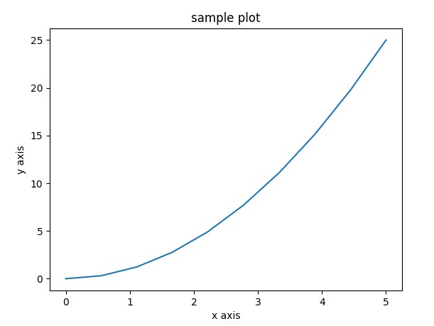
:::

 

In the preceding example, we imported two
modules,`matplotlib`and`numpy`, to visualize the
data as well as to create the arrays [*x*] and
[*y*], respectively. After this, we plotted two arrays
as`plt.plot(x,y)`. Then we added a title and labels to the
plot using the`xlabel()`,
`ylabel()`, and`title()`functions, and to display
this plotting, we used the`plt.show()`function. Because we are
using Matplotlib within a Python script, don\'t forget to
add`plt.show()`at the end line to display your plot.

Now we are going to create two arrays to display two lines of curves in
the plot and we are going to apply style to both the curves. In the
following example, we will use the `ggplot` style to plot the
graph. `ggplot` is a system used for creating graphics
declaratively, and is based on the grammar of graphics. To plot
`ghraph`, we just provide the data and then tell
`ggplot` how to map variables and what graphical primitives to
use, and it takes care of the details. In
most cases, we start with the `ggplot()` style.

Now, create a script called `simple_plot2.py` and write the
following content in it:


```
import matplotlib.pyplot as plt
from matplotlib import style

style.use('ggplot')

x1 = [0,5,10]
y1 = [12,16,6]
x2 = [6,9,11]
y2 = [6,16,8]

plt.subplot(2,1,1)
plt.plot(x1, y1, linewidth=3)
plt.title("sample plot")
plt.xlabel("x axis")
plt.ylabel("y axis")
plt.subplot(2,1,2)    
plt.plot(x2, y2, color = 'r', linewidth=3)
plt.xlabel("x2 axis")
plt.ylabel("y2 axis")

plt.show()
```

Run the script and you will get the following output:


```
student@ubuntu:~/work$ python3 simple_plot2.py
```

 

The output is as follows:


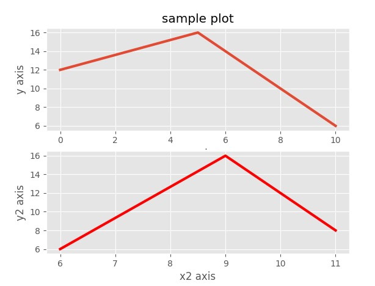
:::

In the preceding example, first we imported
the required module, and then we used the `ggplot` style to
plot the graph.  We created two sets of array; that is,  `x1`,
`y1` and `x2`, `y2`. Then we used the
subplot function, `plt.subplot()`, because it allows us to
plot different things within the same canvas. You can also use
the `plt.figure()` function instead of
`plt.subplot(),` if you want to display these two plots on a
different canvas.

Now, we are going to see how to plot the arrays using
the `plt.figure()` function and save our generated figure
using Matplotlib. You can save them in different formats, such as
`png`, `jpg`, `pdf`, and so on, by using
the `savefig()` method. We\'ll save the preceding figure in a
file named `my_sample_plot.jpg`. Now, we will look at an
example. For that, create a script called `simple_plot3.py`
and write the following content in it:


```
import matplotlib.pyplot as plt
from matplotlib import style

style.use('ggplot')

x1 = [0,5,10]
y1 = [12,16,6]
x2 = [6,9,11]
y2 = [6,16,8]

plt.figure(1)
plt.plot(x1, y1, color = 'g', linewidth=3)
plt.title("sample plot")
plt.xlabel("x axis")
plt.ylabel("y axis")
plt.savefig('my_sample_plot1.jpg')
plt.figure(2)

plt.plot(x2, y2, color = 'r', linewidth=3)
plt.xlabel("x2 axis")
plt.ylabel("y2 axis")
plt.savefig('my_sample_plot2.jpg')

plt.show()
```

Run the script and you will get the following output:


```
student@ubuntu:~/work$ python3 simple_plot3.py
```

The output is as follows:


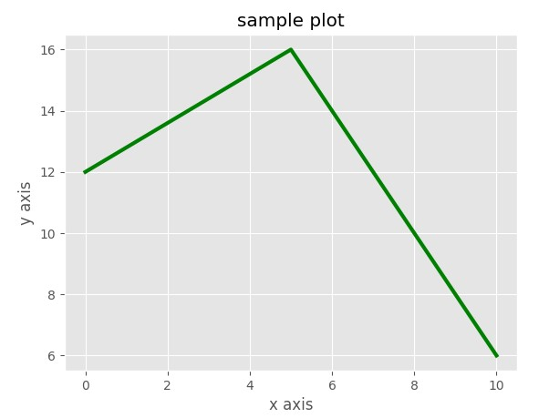

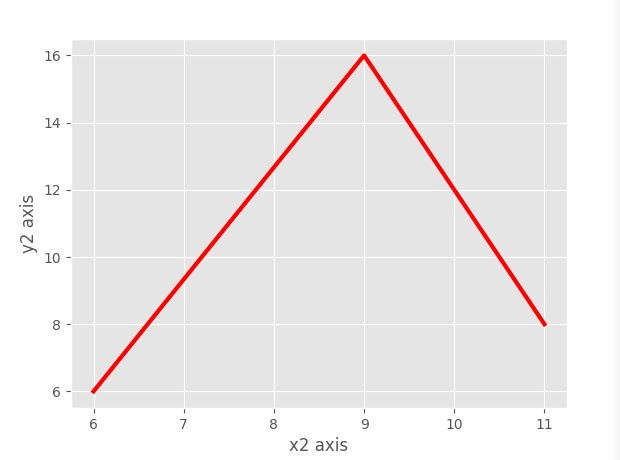
:::

In the preceding example, we used the `plt.figure()` function
to plot the things on a different canvas.  After that, we used the
`plt.plot()` function. This function has different arguments,
which are useful to plot the graph. In the preceding example, we used
some of arguments; that is `x1`, `x2`,
`y1`,and `y2`. These are the respective axis points
used to plot.

 

Then we  used the `color` argument to provide a particular
color to the graph line and, in the third argument, we used
`linewidth`, which decides the width of the graph line. After
that, we also used the `savefig()` method to save our figure
in a particular image format. You can check them in your current
directory (if you did not mention the path) where you run your Python
script.

You can open those images by directly accessing[]{#id326132513
.indexterm} that directory or you can also use following method to open
those generated images using `matplotlib`. Now, we will look
at an example to open saved figures. For that, create a script
called `open_image.py` and write the following content in it:


```
import matplotlib.pyplot as plt
import matplotlib.image as mpimg

plt.imshow(mpimg.imread('my_sample_plot1.jpg'))
plt.show()
```

Run the script and you will get the following output:


```
student@ubuntu:~/work$ python3 open_image.py
```

The output is as follows:


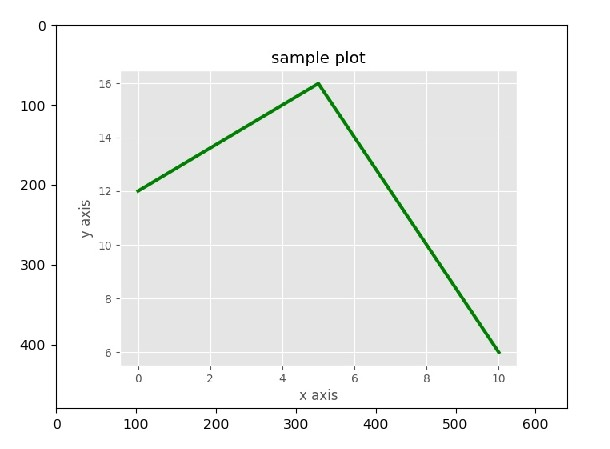
:::

In the preceding example, we used the `imshow()` function of
Matplotlib to open the saved image of the figure.

Now, we will look at different types of plots. Matplotlib
allows us to create different types of plots
to deal with data in arrays, such as histograms, scatter plots, bar
charts, and so on. The use of different kinds of plots depends on the
purpose of the data visualization. Let\'s look at some of these plots.


#### Histograms


This type of plot helps us to examine the
distribution of  numerical data in such a way
that you are unable to make do with mean or median alone. We are going
to use the `hist()` method to create a simple histogram.
Let\'s look at an example to create a simple histogram. For that, create
a script called `histogram_example.py` and write the following
content in it:


```
import matplotlib.pyplot as plt
import numpy as np

x = np.random.randn(500)
plt.hist(x)
plt.show()
```

Run the script and you will get the following output:


```
student@ubuntu:~/work$ python3 histogram_example.py
```

 

 

 

 

The output is as follows:


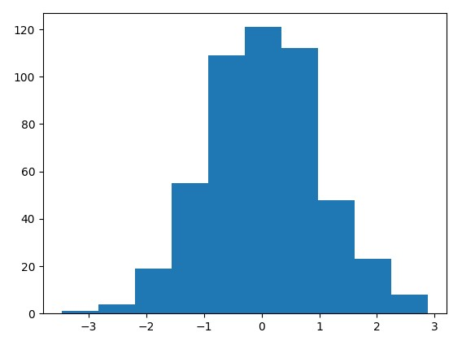
:::

In the preceding example, we created an array of random numbers using
`numpy`. Then we plotted that numerical data using
the `plt.hist()` method.


#### Scatter plots


This type of plot shows us the data as a collection[]{#id326151797
.indexterm} of points. It offers a convenient way to visualize how
numeric values are related. It also helps us to understand the
relationships between multiple variables. We are going to use
the `scatter()` method to plot the data in a scatter plot. In
a scatter plot, the position of points depends on its `x` and
`y` axis values; that is, two-dimensional values, so each
value in a dataset is a position in either the horizontal or the
vertical dimension. Let\'s look at an example of a scatter plot. Create
a script called `scatterplot_example.py` and write the
following content in it:


```
import matplotlib.pyplot as plt
import numpy as np

x = np.linspace(-2,2,100)
y = np.random.randn(100)
colors = np.random.rand(100)
plt.scatter(x,y,c=colors)
plt.show()
```

 

Run the script and you will get the following output:


```
student@ubuntu:~/work$ python3 scatterplot_example.py
```

The output is as follows:


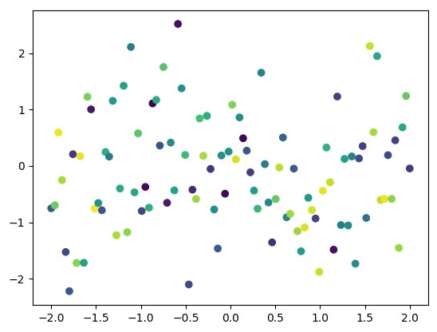
:::

In the preceding example, we got values of `x` and
`y`. Then we plotted those values using
the `plt.scatter()` method to get a scatter plot for
the `x` and `y` values.


#### Bar charts


A bar chart is a chart that represents your data[]{#id326158858
.indexterm} in rectangular bars. You can plot them vertically or
horizontally. Create a script called  `bar_chart.py` and write
the following content in it:


```
import matplotlib.pyplot as plt
from matplotlib import style

style.use('ggplot')

x1 = [4,8,12]
y1 = [12,16,6]
x2 = [5,9,11]
y2 = [6,16,8]

plt.bar(x1,y1,color = 'g',linewidth=3)
plt.bar(x2,y2,color = 'r',linewidth=3)
plt.title("Bar plot")

plt.xlabel("x axis")
plt.ylabel("y axis")

plt.show()
```

Run the script and you will get the following output:


```
student@ubuntu:~/work$ python3 bar_chart.py
```

The output is as follows:


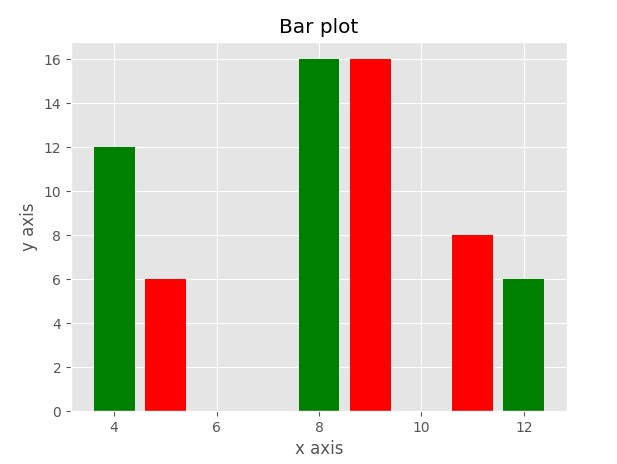
:::

In the preceding example, we have two sets of values: `x1`,
`y1` and `x2`, `y2`. After getting the
numerical data, we used the `plt.bar()` method to plot the bar
chart for the present data.

There are multiple techniques available to plot the data. Among them,
there are a few techniques or methods of data visualization using
`matplotlib`, which we have seen. We can also perform such
operations using another tool of data visualization: `plotly`.

 

### Plotly


Plotly is an interactive, open source graphing[]{#id326158973
.indexterm} library in Python. It is a charting library that provides
over 30 chart types, such as scientific charts, 3D graphs, statistical
charts, financial charts, and more.

To use `plotly` in Python, first we have to install it in
our system. To install `plotly`,
run the following command in your Terminal:


```
$ pip3 install plotly
```

We can use `plotly` online as well as offline. For online
usage, you need to have a `plotly` account and after that you
need to set up your credentials in Python:


```
            plotly.tools.set_credentials_file(username='Username', api_key='APIkey')
```

To use `plotly` offline, we need to use the `plotly`
function:  `plotly.offline.plot()`

In this section, we are going to use plotly offline. Now, we are going
to look at a simple example. For that, create a script
called `sample_plotly.py` and write the following content in
it:


```
import plotly
from plotly.graph_objs import Scatter, Layout

plotly.offline.plot({
    "data": [Scatter(x=[1, 4, 3, 4], y=[4, 3, 2, 1])],
    "layout": Layout(title="plotly_sample_plot")
})
```

Run the preceding script as `sample_plotly.py`. You will get
the following output:


```
student@ubuntu:~/work$ python3 sample_plotly.py
```

 

 

 

 

The output is as follows:


:::

In the preceding example, we imported the `plotly` module and
then we set `plotly` for offline use. We put arguments in it,
which are useful to plot a graph. In the example, we used some of
arguments: `data` and `layout`. In the
`data` argument, we define the scatter function with
`x` and `y` arrays, which have values to plot over
the `x` and `y` axes, respectively. Then we use the
`layout` argument, in which we define the layout function to
provide the title for the graph. The output of the preceding program is
saved as an HTML file and gets opened in your default browser. This HTML
file is in the same directory as your script.

Now let\'s look at some different types of charts for visualizing the
data. So, first, we are going to start with the scatter plot.


#### Scatter plots


Create a script called `scatter_plot_plotly.py` and write the
following content in it:


```
import plotly
import plotly.graph_objs as go
import numpy as np

x_axis = np.random.randn(100)
y_axis = np.random.randn(100)

trace = go.Scatter(x=x_axis, y=y_axis, mode = 'markers')
data_set = [trace]
plotly.offline.plot(data_set, filename='scatter_plot.html')
```

 

 

 

 

 

 

Run the script and you will get the following output:


```
student@ubuntu:~/work$ python3 scatter_plot_plotly.py
```

The output is as follows:


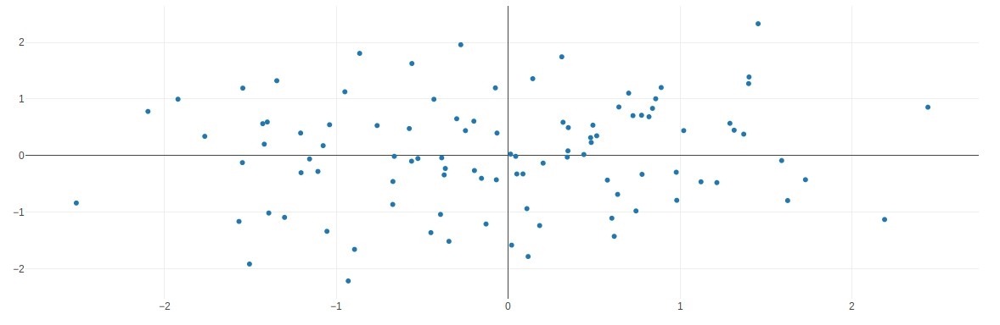
:::

In the preceding example, we imported `plotly` and then
created random data by using `numpy` and, for that, import
the `numpy` module in your script. After generating the
dataset, we created one object named `trace` and inserted our
numerical data in it to be scattered. Then, finally, we place the data
in the `trace` object into
the `plotly.offline.plot()` function to get the scatter plot
of data. Like our first sample graph, the output of this example is
also saved in HTML format and displayed in your default web browser.


#### Line scatter plots


We can also create some more informative plots, such as a line scatter
plot. Let\'s look at an example. Create a script
called `line_scatter_plot.py` and write the
following content in it:


```
import plotly
import plotly.graph_objs as go
import numpy as np

x_axis = np.linspace(0, 1, 50)
y0_axis = np.random.randn(50)+5
y1_axis = np.random.randn(50)
y2_axis = np.random.randn(50)-5

trace0 = go.Scatter(x = x_axis,y = y0_axis,mode = 'markers',name = 'markers')
trace1 = go.Scatter(x = x_axis,y = y1_axis,mode = 'lines+markers',name = 'lines+markers')
trace2 = go.Scatter(x = x_axis,y = y2_axis,mode = 'lines',name = 'lines')

data_sets = [trace0, trace1, trace2]
plotly.offline.plot(data_sets, filename='line_scatter_plot.html')
```

Run the script and you will get the following output:


```
student@ubuntu:~/work$ python3 line_scatter_plot.py
```

The output is as follows:


:::

In the preceding example, we imported `plotly`, as well as
the `numpy` module. Then we generated some random values for
the  x-axis and also for three different y-axes. After that, we put that
data in the created `trace` object and, finally, put that
dataset in plotly\'s offline function. Then we get the output in the
format of scatter as well as line. The output file of this example is
saved with the name `line_scatter_plot.html` in your current
directory.


#### Box plots


The box plot is usually informative and also helpful, especially when
you have too much to show with very less data. Let\'s look at an
example. Create a script called `plotly_box_plot.py` and write
the following content in it:


```
import random
import plotly
from numpy import *

N = 50.
c = ['hsl('+str(h)+',50%'+',50%)' for h in linspace(0, 360, N)]
data_set = [{
    'y': 3.5*sin(pi * i/N) + i/N+(1.5+0.5*cos(pi*i/N))*random.rand(20),
    'type':'box',
    'marker':{'color': c[i]}
    } for i in range(int(N))]

layout = {'xaxis': {'showgrid':False,'zeroline':False, 'tickangle':45,'showticklabels':False},
          'yaxis': {'zeroline':False,'gridcolor':'white'},
          'paper_bgcolor': 'rgb(233,233,233)',
          'plot_bgcolor': 'rgb(233,233,233)',
          }

plotly.offline.plot(data_set)
```

Run the script and you will get the following output:


```
student@ubuntu:~/work$ python3 plotly_box_plot.py
```

The output is as follows:


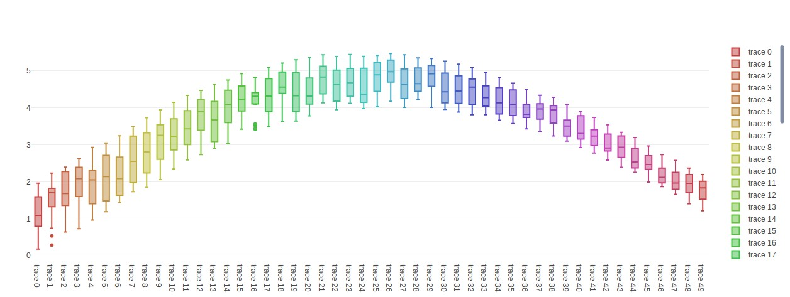
:::

In the preceding example, we imported `plotly`, as well as
the `numpy` module. Then we declared N as the total number
boxes in the box plot and generated an array of rainbow colors by fixing
the saturation and lightness of the HSL representation of color and
marching around the hue. Each box is represented by a dictionary that
contains the data, the type, and the color. We use list comprehension to
describe N boxes, each with a different color and with different
randomly generated data. After that, we format the layout of the output
and plot the data through the offline `plotly` function.

 


#### Contour plots


The contour plot is most commonly used as a scientific plot and used a
lot while showing heat map data. Let\'s look at an example of a contour
plot. Create a script called `contour_plotly.py` and write the
following content in it:


```
from plotly import tools
import plotly
import plotly.graph_objs as go

trace0 = go.Contour(
    z=[[1, 2, 3, 4, 5, 6, 7, 8],
       [2, 4, 7, 12, 13, 14, 15, 16],
       [3, 1, 6, 11, 12, 13, 16, 17],
       [4, 2, 7, 7, 11, 14, 17, 18],
       [5, 3, 8, 8, 13, 15, 18, 19],
       [7, 4, 10, 9, 16, 18, 20, 19],
       [9, 10, 5, 27, 23, 21, 21, 21]],
     line=dict(smoothing=0),
)
trace1 = go.Contour(
    z=[[1, 2, 3, 4, 5, 6, 7, 8],
       [2, 4, 7, 12, 13, 14, 15, 16],
       [3, 1, 6, 11, 12, 13, 16, 17],
       [4, 2, 7, 7, 11, 14, 17, 18],
       [5, 3, 8, 8, 13, 15, 18, 19],
       [7, 4, 10, 9, 16, 18, 20, 19],
       [9, 10, 5, 27, 23, 21, 21, 21]],
     line=dict(smoothing=0.95),
)
data = tools.make_subplots(rows=1, cols=2,
                        subplot_titles=('Smoothing_not_applied', 'smoothing_applied'))
data.append_trace(trace0, 1, 1)
data.append_trace(trace1, 1, 2)

plotly.offline.plot(data)
```

Run the script and you will get the following output:


```
student@ubuntu:~/work$ python3 contour_plotly.py
This is the format of your plot grid:
[ (1,1) x1,y1 ]  [ (1,2) x2,y2 ]
```

 

The output is as follows:


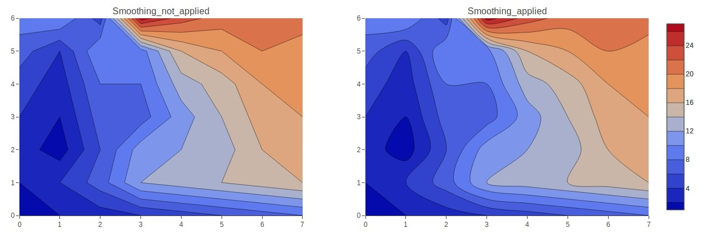
:::

 

In the preceding example, we took a dataset and applied the
`contour()` function on it. Then we appended that contour data
in `data_set` and, finally, applied the
`plotly` function on the data to get the output. These are
some techniques from plotly to plot data in a visual manner.


Summary
--------------------------


In this lab, we learned about the NumPY and Pandas modules, as well
as data visualization techniques. In the NumPY module section, we
learned about indexing and slicing the array and the universal array
function. In the pandas module section, we learned about Series and
DataFrames. We also learned how to read a `csv` file into a
DataFrame. In data visualization, we learned about the  libraries in
Python, which are used for data visualization: `matplotlib`
and `plotly`.

In the next lab, you will learn about MySQL and SQLite database
administrations.


Questions
----------------------------


1.  What is a NumPy array?
2.  What is the output of the following code snippet?

```
import numpy as np
# input array
in_arr1 = np.array([[ 1, 2, 3], [ -1, -2, -3]] )
print ("1st Input array : \n", in_arr1) 
in_arr2 = np.array([[ 4, 5, 6], [ -4, -5, -6]] )
print ("2nd Input array : \n", in_arr2) 
# Stacking the two arrays horizontally
out_arr = np.hstack((in_arr1, in_arr2))
print ("Output stacked array :\n ", out_arr)
```


3.  How do you sum a small array faster than `np.sum`? 
4.  How do you delete indices, rows, or columns from a Pandas DataFrame?
5.  How do you write a Pandas DataFrame to a file?
6.  What is NaN in pandas ?
7.  How do you remove duplicates from a pandas DataFrame ?
8.  How do you change the size of figures drawn with Matplotlib?
9.  What are the alternatives available for plotting graphs using Python
    ?


Further reading
----------------------------------


-   10 minutes to pandas
    documentation: <https://pandas.pydata.org/pandas-docs/stable/> 
-   NumPy
    tutorial: <https://docs.scipy.org/doc/numpy/user/quickstart.html> 
-   Graph plotting using
    plotly: <https://plot.ly/d3-js-for-python-and-pandas-charts/> 
