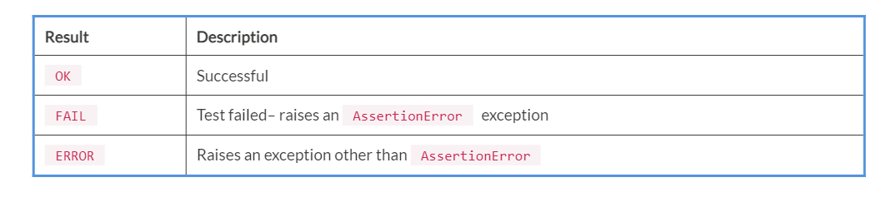

Lab 3. Unit Testing - Introduction to the Unit Testing Framework
-----------------------------------------------------------------------------


In this lab, you will learn about the following topics:


-   Introduction to unit testing framework
-   Creating unit testing tasks


Creating unit tests
-------------------------------------

In this section, we are going to create unit
tests. To do this, we will create two scripts. One will be your normal
script and the other will contain the code for testing.

First, create a script named `arithmetic.py` and write the
following code in it:


```
# In this script, we are going to create a 4 functions: add_numbers, sub_numbers, mul_numbers, div_numbers.
def add_numbers(x, y):
    return x + y

def sub_numbers(x, y):
    return x - y

def mul_numbers(x, y):
    return x * y

def div_numbers(x, y):
    return (x / y)
```

In the preceding script, we created four functions:
`add_numbers`, `sub_numbers`,
`mul_numbers`, and `div_numbers`. Now, we are going
to write test cases for these functions. First, we will learn how we can
write test cases for the `add_numbers` function. Create
a `test_addition.py` script and write the following code in
it:


```
import arithmetic
import unittest

# Testing add_numbers function from arithmetic.
class Test_addition(unittest.TestCase):
    # Testing Integers
    def test_add_numbers_int(self):
        sum = arithmetic.add_numbers(50, 50)
        self.assertEqual(sum, 100)

    # Testing Floats
    def test_add_numbers_float(self):
        sum = arithmetic.add_numbers(50.55, 78)
        self.assertEqual(sum, 128.55)

    # Testing Strings
    def test_add_numbers_strings(self):
        sum = arithmetic.add_numbers('hello','python')
        self.assertEqual(sum, 'hellopython')

if __name__ == '__main__':
    unittest.main()
```


Now, we will run our `test_addition.py`test script and we will
see what result we get after running this script.

Run the script as follows and you will get
the following output:


```
student@ubuntu:~$ python3 test_addition.py
...
----------------------------------------------------------------------
Ran 3 tests in 0.000s

OK
```

Here, we get `OK` , which means our testing was successful.

Whenever you run your test script, you have three possible test results:




You can use the `unittest` module from the command line as
well. So, you can run the previous test script as follows:


```
student@ubuntu:~$ python3 -m unittest test_addition.py
...
----------------------------------------------------------------------
Ran 3 tests in 0.000s

OK
```

Now, we will see another example. We will create two scripts:
`if_example.py` and `test_if.py`.
`if_example.py` will be our normal script and
`test_if.py` will contain test case. In this test, we are
checking whether the entered number is equal to `100` or not.
If it is equal to `100` then our test will be
`successful`. If not, it must show a `FAILED`
result. 

Create a `if_example.py` script and write the following code
in it:


```
def check_if():
    a = int(input("Enter a number \n"))
    if (a == 100):
        print("a is equal to 100")

    else:
        print("a is not equal to 100")

    return a
```

Now, create a `test_if.py`test script and write following code
in it:


```
import if_example
import unittest

class Test_if(unittest.TestCase):
    def test_if(self):
        result = if_example.check_if()
        self.assertEqual(result, 100)

if __name__ == '__main__':
    unittest.main()
```


Run the test script as follows:


```
student@ubuntu:~/Desktop$ python3 -m unittest test_if.py
Enter a number
100
a is equal to 100
.
----------------------------------------------------------------------
Ran 1 test in 1.912s

OK
```

We run the script for a successful test result. Now, we will enter some
value other than `100` and we must get a `FAILED`
result. Run the script as follows:


```
student@ubuntu:~/Desktop$ python3 -m unittest test_if.py
Enter a number
50
a is not equal to 100
F
======================================================================
FAIL: test_if (test_if.Test_if)
----------------------------------------------------------------------
Traceback (most recent call last):
  File "/home/jovyan/Desktop/test_if.py", line 7, in test_if
    self.assertEqual(result, 100)
AssertionError: 50 != 100

----------------------------------------------------------------------
Ran 1 test in 1.521s

FAILED (failures=1)
```


**Summary**


In this lab, we have learned about the `unittest`, which
is Python\'s unit testing framework. We also learned about how to create
test cases and methods used in unit testing.

 
**Questions**

1.  What is unit testing, automation testing, and manual testing?
2.  What are the alternative modules available apart from
    `unittest`?
3.  What is the use of writing test cases?
4.  What is PEP8 standards ?

