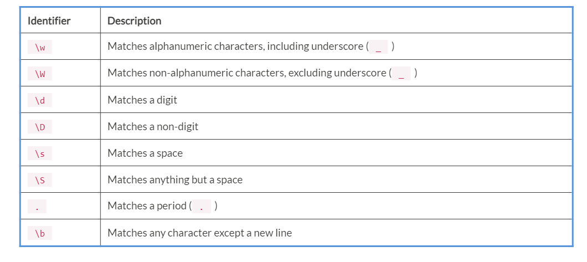
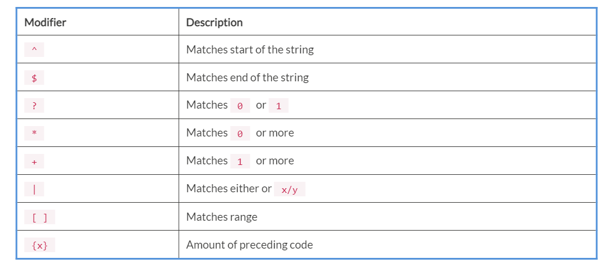
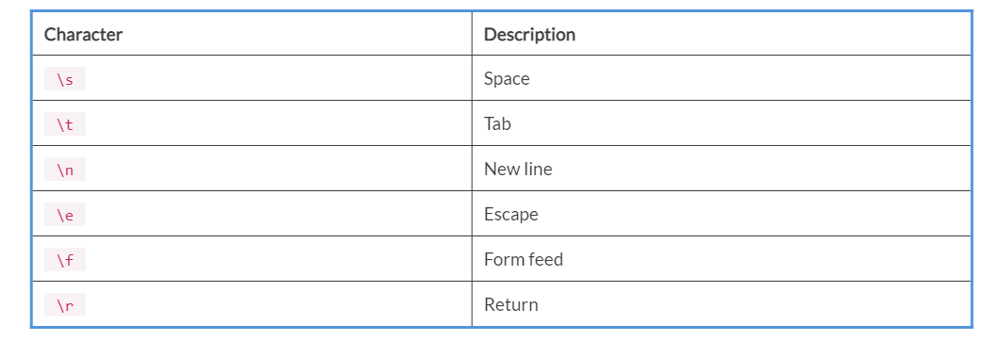
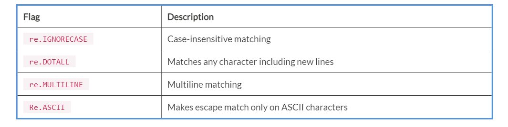

Lab 7. Text Processing and Regular Expressions
-----------------------------------------------------------


In this lab, we are going to learn about text processing and regular
expressions. Text processing is a process of creating or modifying the
text. Python has a very powerful library called regular expressions that
does tasks such as searching and extracting the data. You will learn how
to do it with files and also learn to read and write to files.

We are going to learn about the `re` Python module for regular
expressions and processing text in Python. We are going to learn about
the `match()`, `search()`, `findall()`,
and `sub()` functions of `re` module. We are also
going to learn about text wrapping in Python using
the `textwrap` module. Finally, we will learn about unicode
characters.

In this lab, we will cover the following topics:


-   Text wrapping
-   Regular expressions
-   Unicode strings


Text wrapping
-------------------------------


In this section, we will learn about the `textwrap` Python
module. This module provides
the `TextWrapper` class that does all the work. The
`textwrap` module is used for formatting and
wrapping plain text. This module provides
five main
functions: `wrap()`, `fill()`, `dedent()`, `indent()`,
and `shorten()`. We are going to learn these functions one by
one now.

 


### The wrap() function


The `wrap()` function is used to wrap an entire paragraph in to a single string. The
output will be a list of output lines.

The syntax is `textwrap.wrap(text, width)`:


-   `text`: Text to wrap.
-   `width`: Maximum length allowed of a wrapped line. The
    default value is `70`.


Now, we will see an example of `wrap()`. Create
a `wrap_example.py` script and write the following content in
it:


```
import textwrap

sample_string = '''Python is an interpreted high-level programming language for general-purpose programming. Created by Guido van Rossum and first released in 1991, Python has a design philosophy that emphasizes code readability, notably using significant whitespace.'''

w = textwrap.wrap(text=sample_string, width=30)
print(w)
```

Run the script and you will get the output as follows:


```
student@ubuntu:~/work$ python3 wrap_example.py
['Python is an interpreted high-', 'level programming language for', 'general-purpose programming.', 'Created by Guido van Rossum', 'and first released in', '1991, Python has a design', 'philosophy that emphasizes', 'code readability,  notably', 'using significant whitespace.']
```

In the preceding example, we used the `textwrap` module of
Python. First, we created a string named `sample_string`.
Next, using the `TextWrapper` class we specified the width.
Next, using the `wrap` function the string was wrapped to the
width of `30`. And next, we printed the lines.


### The fill() function


The `fill()` function works similarly
to `textwrap.wrap`, except it returns the data
joined into a single, newline-separated
string. This function wraps the input in text and returns a
single string containing the wrapped text.

 

The syntax for this function is: 


```
textwrap.fill(text, width)
```


-   `text`: Text to wrap.

-   `width`: Maximum length allowed of a wrapped line. The
    default value is `70`.


Now, we will see an example of `fill()`. Create
a `fill_example.py` script and write the following content in
it:


```
import textwrap

sample_string = '''Python is an interpreted high-level programming language.'''

w = textwrap.fill(text=sample_string, width=50)
print(w)
```

Run the script and you will get the output as follows:


```
student@ubuntu:~/work$ python3 fill_example.py
Python is an interpreted high-level programming
language.
```

In the preceding example, we used the `fill()` function. The
procedure is the same as what we did in `wrap()`. First, we
created a string variable. Next, we created
the `textwrap` object. Then, we applied
the `fill()` function. Finally, we printed the output.


### The dedent() function


The `dedent()` is another function of
the `textwrap` module. This function removes the common
leading `whitespaces` from every line of your text.  

The syntax for this function is as follows:


```
 textwrap.dedent(text)
```

`text` is the text to `dedent`.

 

Now, we will see an example of `dedent()`. Create a
`dedent_example.py` script and write the following content in
it:


```
import textwrap

str1 = '''
            Hello Python World \tThis is Python 101
            Scripting language\n
            Python is an interpreted high-level programming language for general-purpose programming.
            '''
print("Original: \n", str1)
print()

t = textwrap.dedent(str1)
print("Dedented: \n", t)
```

Run the script and you will get the output as follows:


```
student@ubuntu:~/work$ python3 dedent_example.py

Hello Python World   This is Python 101
Scripting language

Python is an interpreted high-level programming language for general-purpose programming.
```

In the preceding example, we created a `str1` string variable.
Then we used `textwrap.dedent()` to remove the common leading
whitespaces. Tabs and spaces are considered whitespaces, but they are
not equal. Therefore, the only common whitespace, which in our case
is `tab`, is removed.


### The indent() function


The `indent()` function is used to add the
specified prefix to the beginning of the
selected lines in your text.

The syntax for this function is: 


```
            textwrap.indent(text, prefix)
```


-   `text`: The main string
-   `prefix`: The prefix to add


Create a `indent_example.py` script and write the following
content in it:


```
import textwrap

str1 = "Python is an interpreted high-level programming language for general-purpose programming. Created by Guido van Rossum and first released in 1991, \n\nPython has a design philosophy that emphasizes code readability, notably using significant whitespace."

w = textwrap.fill(str1, width=30)
i = textwrap.indent(w, '*')
print(i)
```

Run the script and you will get the output as follows:


```
student@ubuntu:~/work$ python3 indent_example.py
*Python is an interpreted high-
*level programming language for
*general-purpose programming.
*Created by Guido van Rossum
*and first released in 1991,
*Python has a design philosophy
*that emphasizes code
*readability, notably using
*significant whitespace.
```

In the preceding example, we used the `fill()` and
`indent()` functions of the `textwrap` module.
First, we used the `fill` method to store the data into
the `w` variable. Next, we used the `indent` method.
Using `indent(),` each line in the output will have
a `*` prefix. And next, we printed the output.


### The shorten() function


This function of the `textwrap`module is used truncate the text to fit in the
specified width. For example, if you want to
create a summary or preview, use the `shorten()` function.
Using `shorten()`, all the whitespaces in your text will get
standardized into a single space.

The syntax for this function is:


```
textwrap.shorten(text, width)
```

 

Now we will see an example of `shorten()`. Create
a `shorten_example.py` script and write the following content
in it:


```
import textwrap

str1 = "Python is an interpreted high-level programming language for general-purpose programming. Created by Guido van Rossum and first released in 1991, \n\nPython has a design philosophy that emphasizes code readability, notably using significant whitespace."

s = textwrap.shorten(str1, width=50)
print(s)
```

Run the script and you will get the output as follows:


```
student@ubuntu:~/work$ python3 shorten_example.py
Python is an interpreted high-level [...]
```

In the preceding example, we used the `shorten()` function to
truncate our text and fit that text in a specified width. First, all the
whitespaces truncated into the single space. If the result fited in the
specified width, the result was displayed on the screen. If not, then
the words of the specified width was displayed on the screen and the
rest was placed in the placeholder.


Regular expressions
-------------------------------------


In this section, we are going to learn about
regular expressions in Python. Regular expression is a specialized
programming language, which is embedded in Python and is available to
users through the `re` module. We can define the rules for the
set of strings that we want to match. Using regular expressions, we can
extract specific information from files, code, documents, spreadsheets,
and so on.

In Python, a regular expression is denoted as `re` and can be
imported through the `re` module. Regular expressions support
four things:


-   Identifiers
-   Modifiers
-   Whitespace characters
-   Flags


The following table lists the identifiers,
and there\'s a description for each one:



The following table lists the modifiers, and
there\'s a description for each one:


 

The following table lists the whitespace
characters, and there\'s a description for each one:


The following table lists the flags, and there\'s a description for
each one:



Now we are going to see some examples of regular expressions. We are
going to learn about the `match()`, `search()`,
`findall()`, and `sub()` functions.


### Note

To use regular expressions in Python, you must import the `re`
module in your scripts so that you will be able to use all the functions
and methods for regular expressions.


Now we are going to learn about these functions one by one in the
following sections.


### The match() function


The `match()` function is a function of the `re` module. This function will match the
specified `re` pattern with the string. If the match is found,
a `match` object will be returned.
A `match` object will contain the information about the
`match`. If a match is not found, we will get the result as
`None`. The `match` object has two methods:


-   `group(num)`: Returns an entire match
-   `groups()`: Return all matching subgroups in tuple


The syntax for this function is as follows:


```
re.match(pattern, string)
```

Now, we are going see an example of `re.match()`. Create
a `re_match.py`script and write the following content in it:


```
import re

str_line = "This is python tutorial. Do you enjoy learning python ?"
obj = re.match(r'(.*) enjoy (.*?) .*', str_line)
if obj:
            print(obj.groups())
```

Run the script and you will get the output as follows:


```
student@ubuntu:~/work$ python3 re_match.py
('This is python tutorial. Do you', 'learning')
```

In the preceding script, we imported the `re` module to use
regular expressions in Python. Then we created
a `str_line` string. Next, we created an `obj` match
object and store the match pattern result in it. In this example,
the `(.*) enjoy (.*?) .*` pattern will print everything before
the `enjoy` keyword, and it will print only one word after
the `enjoy` keyword. Next, we used the `groups()`
method of `match` object. It will print all the matched
substrings in a tuple. So, the output you will get will be,
`('This is python tutorial. Do you', 'learning')`.


### The search() function


The `search()` function of the `re` module will
search through a string. It will look for any
location for the specified `re` pattern. The
`search()` will take a pattern and text and it will search
through our specified string for a match. It will return a
`match` object when a match is found. It will return `None` if no match found. The
`match` object has two methods:


-   `group(num)`: Returns an entire match
-   `groups()`: Returns all matching subgroups in tuple


The syntax for this function is as follows: 


```
re.search(pattern, string)
```

Create a `re_search.py`script and write following content in
it:


```
import re

pattern = ['programming', 'hello']
str_line = 'Python programming is fun'
for p in pattern:
            print("Searching for %s in %s" % (p, str_line))
            if re.search(p, str_line):
                        print("Match found")
            else:
                        print("No match found")
```

Run the script and you will get the output as follows:


```
student@ubuntu:~/work$ python3 re_search.py
Searching for programming in Python programming is fun
Match found
Searching for hello in Python programming is fun
No match found
```

In the preceding example, we used the `search()` method of
`match` object to find the `re` pattern. After
importing the re module, we specified the pattern in a list. In that
list, we wrote two strings: `programming` and
`hello`. Next, we created a string:
`Python programming is fun`. We wrote a for loop that will
check for a specified pattern one by one. If a match is found,
the `if` block will be executed. If no match is found,
the `else` block will be executed.


### The findall() function


This is one of the methods of the
`match` object. The `findall()` method finds all the
matches and then returns them as a list of strings. Each element of the
list represents as a match. This method
searches for the pattern without overlapping.

Create a `re_findall_example.py`script and write the following
content in it:


```
import re

pattern = 'Red'
colors = 'Red, Blue, Black, Red, Green'
p = re.findall(pattern, colors)
print(p)

str_line = 'Peter Piper picked a peck of pickled peppers. How many pickled peppers did Peter Piper pick?'
pt = re.findall('pe\w+', str_line)
pt1 = re.findall('pic\w+', str_line)
print(pt)
print(pt1)

line = 'Hello hello HELLO bye'
p = re.findall('he\w+', line, re.IGNORECASE)
print(p)
```

Run the script and you will get the output as follows:


```
student@ubuntu:~/work$ python3 re_findall_example.py
['Red', 'Red']
['per', 'peck', 'peppers', 'peppers', 'per']
['picked', 'pickled', 'pickled', 'pick']
['Hello', 'hello', 'HELLO']
```

 

In the preceding script, we have written three examples of
the `findall()` method. In the first example, we defined a
pattern and a string. We found that pattern from the string using
the `findall()` method and then printed it. In the second
example, we created a string and we found the words whose first two
letters are `pe` using `findall()` and then printing
them. We will get the list of words whose first two letters are
`pe`.

In addition, we found the words whose first three letters are
`pic` and then print them. Here, also, we will get the list of
strings. In the third example, we created a string in which we specified
`hello` in uppercase and lowercase, and a word:
`bye`. Using `findall()`, we find the words whose
first two letters are `he`. Also in `findall()`, we
used a `re.IGNORECASE`flag that will ignore the case of the
word and printed them.


### The sub() function


This is one of the most important functions
of the re module. The `sub()` is used for replacing the
`re` pattern with the specified replacement. It will replace
all the occurrences of the `re`
pattern with the replacement string. The syntax is as follows:


```
  re.sub(pattern, repl_str, string, count=0)
```


-   `pattern`: The `re` pattern.
-   `repl_str`: The replacement string.
-   `string`: The main string.
-   `count`: The number of occurrences to be replaced. The
    default value is `0`, which means replacing all
    occurrences.


Now we are going to create a `re_sub.py`script and write the
following content in it:


```
import re

str_line = 'Peter Piper picked a peck of pickled peppers. How many pickled peppers did Peter Piper pick?'

print("Original: ", str_line)
p = re.sub('Peter', 'Mary', str_line)
print("Replaced: ", p)

p = re.sub('Peter', 'Mary', str_line, count=1)
print("Replacing only one occurrence of Peter… ")
print("Replaced: ", p)
```

 

 

 

 

Run the script and you will get the output as follows:


```
student@ubuntu:~/work$ python3 re_sub.py
Original:  Peter Piper picked a peck of pickled peppers. How many pickled peppers did Peter Piper pick?
Replaced:  Mary Piper picked a peck of pickled peppers. How many pickled peppers did Mary Piper pick?
Replacing only one occurrence of Peter...
Replaced:  Mary Piper picked a peck of pickled peppers. How many pickled peppers did Peter Piper pick?
```

In the preceding example, we used `sub()` to replace the
`re` pattern with a specified replacement string. We replaced
`Peter` with `Mary`. So, all the occurrences of
Peter will be replaced by Mary. Next, we also included the
`count` parameter. We mentioned `count=1`: it means
only one occurrence of Peter will be replaced and other occurrences of
Peter will remain the same.

Now, we will learn about the `subn()` function of the re
module. The `subn()` function works the same as
`sub()` with the additional functionality. The
`subn()` function will return a tuple containing the new
string and the number of replacements performed. Let\'s look at an the
example of `subn()`. Create a `re_subn.py`script and
write the following content in it:


```
import re

print("str1:- ")
str1 = "Sky is blue. Sky is beautiful."

print("Original: ", str1)
p = re.subn('beautiful', 'stunning', str1)
print("Replaced: ", p)
print()

print("str_line:- ")
str_line = 'Peter Piper picked a peck of pickled peppers. How many pickled peppers did Peter Piper pick?'

print("Original: ", str_line)
p = re.subn('Peter', 'Mary', str_line)
print("Replaced: ", p)
```

Run the script and you will get the output as follows:


```
student@ubuntu:~/work$ python3 re_subn.py
str1:-
Original:  Sky is blue. Sky is beautiful.
Replaced:  ('Sky is blue. Sky is stunning.', 1)

str_line:-
Original:  Peter Piper picked a peck of pickled peppers. How many pickled peppers did Peter Piper pick?
Replaced:  ('Mary Piper picked a peck of pickled peppers. How many pickled peppers did Mary Piper pick?', 2)
```

In the preceding example, we used the `subn()` function to
replace the RE pattern. As a result, we got a tuple containing the
replaced string and the number of
replacements.


Unicode strings
---------------------------------


In this section, we are going to learn about how to print Unicode strings in Python. Python handles Unicode
strings in a very easy way. The string type actually holds Unicode
strings, not a sequence of bytes.

Start the `python3` console in your system and start writing
the following:


```
student@ubuntu:~/work$ python3
Python 3.6.6 (default, Sep 12 2018, 18:26:19)
[GCC 8.0.1 20180414 (experimental) [trunk revision 259383]] on linux
Type "help", "copyright", "credits" or "license" for more information.
>>> 
>>> print ('\u2713')

>>> print ('\u2724')

>>> print ('\u2750')

>>> print ('\u2780')

>>> chinese = '\u4e16\u754c\u60a8\u597d!
>>> chinese
 ----- (Meaning “Hello world!”)
>>>
>>> s = '\u092E\u0941\u0902\u092C\u0908'
>>> s
'मुंबई'                            ------(Unicode translated in Marathi)
>>>
>>> s = '\u10d2\u10d0\u10db\u10d0\u10e0\u10ef\u10dd\u10d1\u10d0'
>>> s
'გამარჯობა'                 ------(Meaning “Hello” in Georgian)
>>>
>>> s = '\u03b3\u03b5\u03b9\u03b1\u03c3\u03b1\u03c2'
>>> s
'γειασας'                     ------(Meaning “Hello” in Greek)
>>>
```


### Unicode code point


In this section, we are going to learn about the unicode code point.
Python has a powerful built-in function named `ord()` to get a
Unicode code point from a given character. So, let\'s see an
example of getting a Unicode code point from
a character, as shown in the following code:


```
>>> str1 = u'Office'
>>> for char in str1:
... print('U+%04x' % ord(char))
...
U+004f
U+0066
U+0066
U+0069
U+0063
U+0065
>>> str2 = 
>>> for char in str2:
... print('U+%04x' % ord(char))
...
U+4e2d
U+6587
```


### Encoding


The transformation from Unicode code point to byte string is
known as encoding. So, let\'s see an example
of how to encode Unicode code point, as shown in following code:


```
>>> str = u'Office'
>>> enc_str = type(str.encode('utf-8'))
>>> enc_str
<class 'bytes'>
```


### Decoding


The transformation from a byte string to a Unicode code point is
known as decoding. So, let\'s see an example
of how to decode a byte string to get a Unicode code point as shown in
following code:


```
>>> str = bytes('Office', encoding='utf-8')
>>> dec_str = str.decode('utf-8')
>>> dec_str
'Office'
```


### Avoiding UnicodeDecodeError


`UnicodeDecodeError` occurs whenever byte strings cannot decode to Unicode code points. To avoid
this exception, we can pass `replace`,
`backslashreplace`, or `ignore` to the error
argument in `decode` the as shown here:


```
>>> str = b"\xaf"
>>> str.decode('utf-8', 'strict')
    Traceback (most recent call last):
  File "<stdin>", line 1, in <module>
UnicodeDecodeError: 'utf-8' codec can't decode byte 0xaf in position 0: invalid start byte

>>> str.decode('utf-8', "replace")
'\ufffd'
>>> str.decode('utf-8', "backslashreplace")
'\\xaf'
>>> str.decode('utf-8', "ignore")
' '
```


Summary
-------------------------


In this lab, we learned about regular expressions, using which we
can define the rules for a set of strings that we want to match. We
learned about the four functions of the `re` module:
`match()`, `search()`, `findall()`, and
`sub()`.

We learned about the `textwrap` module, which is used for
formatting and wrapping plain text. We also learned about
the `wrap()`, `fill()`, `dedent()`,
`indent()`, and `shorten()` functions of
the `textwrap` module. Finally, we learned about the Unicode
characters and how to print the Unicode strings in Python.

 

 

In the next lab, we are going to learn about standard documenting
and reporting of information using Python.


Questions
---------------------------


1.  What is a regular expression in Python?
2.  Write a Python program to check that a string contains only a
    certain set of characters (in this case, `a–z`,
    `A–Z`, and `0–9`).
3.  Which module in Python supports regular expressions? a)
    `re` b) `regex` c) `pyregex` d) None
    of the above
4.  What does the `re.match`function do? a) Matches a pattern
    at the start of the string b) Matches a pattern at any position in
    the string c) Such a function does not exist d) None of the above
5.  What is the output of the following? Sentence:
    `"we are humans"` Matched:
    `re.match(r'(.*) (.*?) (.*)'`,
    `sentence)``print(matched.group())`


a\) `('we', 'are', 'humans')` b) `(we, are, humans)`
c) `('we', 'humans')` d) `'we are humans'`


